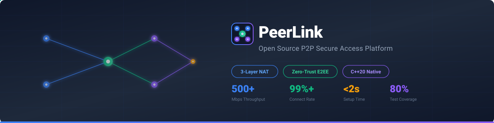
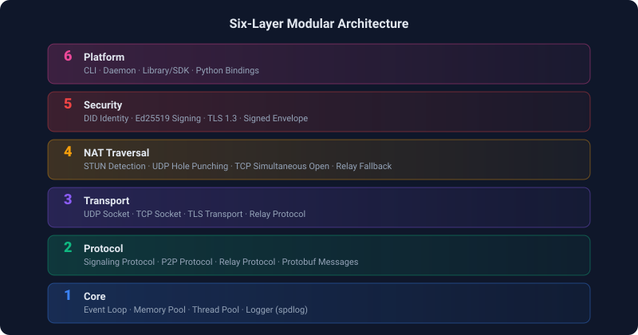
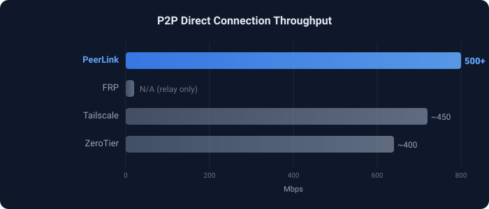

<picture>
  <source media="(prefers-color-scheme: dark)" srcset="docs/images/hero-dark.svg">
  <source media="(prefers-color-scheme: light)" srcset="docs/images/hero-light.svg">
  
</picture>

<p align="center">
  <a href="https://github.com/hbliu007/peerlink/actions/workflows/ci.yml">
    
  </a>
  
  
  
  
  
  <a href="https://github.com/hbliu007/peerlink/stargazers">
    
  </a>
  <a href="https://github.com/hbliu007/peerlink/issues">
    
  </a>
  <a href="https://trendshift.io/repositories/11039" target="_blank" rel="noopener">
    
  </a>
</p>

<p align="center">
  <a href="#-quick-start">Quick Start</a> · <a href="#-how-it-works">How It Works</a> · <a href="#-benchmark">Benchmark</a> · <a href="p2p-cpp/docs">Docs</a> · <a href="#-contributing">Contributing</a>
</p>

---

## Why PeerLink?

You're working from home. You need to SSH into a dev server behind the corporate firewall.
Traditional options all have trade-offs: VPN is complex to deploy, FRP needs open ports, Tailscale depends on third-party DERP servers.

**PeerLink gives you a better option**: self-hosted, zero third-party dependency, P2P direct connection with 99%+ success rate.

> [!IMPORTANT]
> **穿透企业防火墙，让设备像在同一局域网一样互联** — 三层 NAT 穿透降级策略，无需公网 IP、无需开放端口、无需第三方账号。

## 🚀 Quick Start

### 1. Deploy Server (needs a public VPS)

```console
$ git clone https://github.com/hbliu007/peerlink.git
$ cd peerlink/p2p-cpp && cmake -B build -DCMAKE_BUILD_TYPE=Release && cmake --build build -j$(nproc)

$ ./build/src/servers/signaling/p2p-signaling-server
✓ Signaling server listening on :9443
```

### 2. Office Machine (behind firewall)

```console
$ ./build/tools/p2p-tunnel/relay-tunnel server \
    --did office-pc \
    --relay your-server.com:9443 \
    --forward 127.0.0.1:22
✓ Registered as office-pc
✓ Forwarding to 127.0.0.1:22
```

### 3. Your Laptop (at home)

```console
$ ./build/tools/p2p-tunnel/relay-tunnel client \
    --did home-laptop \
    --target office-pc \
    --relay your-server.com:9443 \
    --listen 9022
✓ Connected to office-pc via UDP direct (12ms latency)
✓ Listening on localhost:9022

$ ssh -p 9022 user@localhost
user@office-pc:~$
```

> [!TIP]
> 详细教程: [SSH 隧道](p2p-cpp/docs/tutorials/ssh-tunnel.md) · [阿里云部署](p2p-cpp/docs/how-to/deploy-aliyun.md) · [手机连接](p2p-cpp/docs/tutorials/mobile-connect.md)

## ⚡ Features

| | | |
|:---|:---|:---|
| **3-Layer NAT Traversal** | **Zero-Trust Security** | **High Performance** |
| UDP → TCP → TLS Relay fallback | DID decentralized identity | C++20 native, no GC pauses |
| 99%+ connection success rate | Ed25519 + TLS 1.3 E2EE | 500+ Mbps direct throughput |
| Cone & Symmetric NAT support | Relay cannot decrypt payload | < 50MB memory, < 2s setup |

### Platform Support

| Platform | SDK | Status |
|:---------|:----|:------:|
| Linux (x86_64 / ARM64) | C++ Core | ✅ Stable |
| macOS (Intel / Apple Silicon) | C++ Core | ✅ Stable |
| Android (ARM64) | JNI Bindings | ✅ Stable |
| Python 3.8+ | `py-peerlink` | ✅ Stable |
| iOS | Swift Bindings | 🔄 Planned |

### Protocol Support

| Category | Protocols |
|:---------|-----------|
| **Transport** | TCP · UDP · QUIC · WebRTC · WebTransport |
| **Security** | TLS 1.3 · Noise Protocol · Ed25519 · DID |
| **Multiplexing** | mplex · yamux |
| **NAT Traversal** | STUN · TURN · ICE · UDP/TCP Hole Punching |
| **Discovery** | Kademlia DHT · Bootstrap Nodes · mDNS |
| **PubSub** | GossipSub v1.1 |

## 🔍 How It Works

### Three-Layer NAT Traversal Strategy

```
Layer 1: UDP Hole Punching      ████████████████████░░░░  ~80% Cone NAT
Layer 2: TCP Simultaneous Open  ████████████░░░░░░░░░░░░  +15% Strict NAT
Layer 3: TLS 1.3 Relay          ████████████████████████  100% Guaranteed
```

### Architecture



<details>
<summary><strong>📖 Detailed Layer Description</strong></summary>

| Layer | Module | Responsibilities |
|:-----:|--------|-----------------|
| 1 | **Core** | Event Loop · Memory Pool · Thread Pool · spdlog Logger |
| 2 | **Protocol** | Signaling Protocol · P2P Protocol · Relay Protocol · Protobuf |
| 3 | **Transport** | UDP Socket · TCP Socket · TLS Transport · Async I/O (Boost.Asio) |
| 4 | **NAT** | STUN Detection · UDP Hole Punching · TCP Simultaneous Open · Relay Fallback |
| 5 | **Security** | DID Identity · Ed25519 Signing · TLS 1.3 · Noise Protocol · Signed Envelope |
| 6 | **Platform** | CLI · Daemon · Library/SDK · Python Bindings |

</details>

## 📊 Benchmark



| Metric | Value | Notes |
|:-------|:-----:|:------|
| P2P Direct Throughput | **> 500 Mbps** | Gigabit network |
| Relay Throughput | **> 50 Mbps** | Server bandwidth limited |
| Connection Setup | **< 2 sec** | Including NAT traversal |
| Memory Usage | **< 50 MB** | Daemon process |
| Concurrent Connections | **10,000+** | Single machine |
| Test Coverage | **80.1%** | 86.7% function coverage |

### Throughput by Protocol

| Protocol | Throughput | Latency |
|:---------|:----------:|:-------:|
| TCP Direct | ~500 Mbps | ~20ms |
| QUIC | ~450 Mbps | ~15ms |
| WebRTC | ~400 Mbps | ~25ms |
| Relay (TURN) | ~50 Mbps | ~100ms |

## 🆚 Comparison

| Feature | PeerLink | FRP | Tailscale | ZeroTier |
|:--------|:--------:|:---:|:---------:|:--------:|
| P2P Direct | ✅ | ❌ | ✅ | ✅ |
| Self-Hosted | ✅ Full | ✅ | ❌ SaaS | ⚠️ Paid |
| Zero 3rd-Party Dep | ✅ | ✅ | ❌ DERP | ❌ Root servers |
| NAT Traversal Layers | **3** | 0 | 3 | 3 |
| E2E Encryption | ✅ | ❌ | ✅ | ✅ |
| Decentralized Identity | ✅ DID | ❌ | ❌ | ❌ |
| License | **MIT** | Apache 2.0 | BSD | BSL 1.1 |
| Language | C++20 | Go | Go | Go |

<details>
<summary><strong>🏭 vs Commercial IoT P2P Platforms</strong></summary>

> _TUTK (1.2亿+ 设备), 大拿 (1200万+ 设备), 尚云互联 (2000万+ 设备) — IoT/摄像头垂直领域。 For 通用 P2P 连接、数据主权和安全透明， PeerLink 是更好的选择._

| Feature | PeerLink | TUTK Kalay | 大拿 Danale | 尚云互联 CS2 |
|:--------|:--------:|:-----------:|:-----------:|:-------------|
| Open Source | ✅ MIT | ❌ 闭源 | ❌ 闭源 | ❌ 闭源 |
| Fully Self-Hosted | ✅ Zero Dep | ❌ Master Server | ❌ Cloud Required | ⚠️ DSK Server |
| E2E Encryption | ✅ TLS 1.3 | ⚠️ DTLS 1.2+ | ⚠️ DSTT Private | ⚠️ P2PKey |
| DID Identity | ✅ W3C DID | ❌ Centralized UID | ❌ Centralized ID | ❌ Centralized ID |
| Zero Vendor Lock-in | ✅ | ❌ UID绑定 | ❌ Cloud绑定 | ⚠️ DID绑定 |
| Python SDK | ✅ | ❌ | ❌ | ❌ |
| Throughput | **>500 Mbps** | IoT级 | IoT级 | IoT级 |
| Security Auditable | ✅ Open | ❌ Closed Source | ❌ Closed Source | ❌ Closed Source |
| Performance Public | ✅ | ❌ Hidden | ❌ Hidden | ❌ Hidden |

</details>

## 💻 API Usage

```cpp
#include <p2p/engine.hpp>

int main() {
    p2p::Config config;
    config.listen_addresses = {"/ip4/0.0.0.0/tcp/0"};
    config.enable_webrtc = true;

    auto engine = p2p::Engine::Create(config);
    engine->Start();

    auto conn = engine->Connect(p2p::PeerId::FromString("QmPeer..."));
    conn->Send("Hello, P2P!");

    engine->Stop();
    return 0;
}
```

## 🔧 Build

```bash
# Prerequisites: CMake 3.20+, C++20 compiler (GCC 11+ / Clang 14+ / MSVC 2022+), OpenSSL 3.0+
git clone https://github.com/hbliu007/peerlink.git
cd peerlink/p2p-cpp

cmake -B build -DCMAKE_BUILD_TYPE=Release
cmake --build build -j$(nproc)

# Run tests
cd build && ctest -V

# Build options
cmake -B build -DBUILD_TESTS=ON          # Enable tests
cmake -B build -DBUILD_SERVERS=ON        # Enable server components
cmake -B build -DBUILD_BINDINGS_PYTHON=ON # Python bindings
```

### Docker

```bash
docker run -it hbliu007/peerlink:latest
```

## 📚 Documentation

| Category | Content |
|:---------|---------|
| **Tutorials** | [Quick Start](p2p-cpp/docs/tutorials/quick-start.md) · [SSH Tunnel](p2p-cpp/docs/tutorials/ssh-tunnel.md) · [Mobile Connect](p2p-cpp/docs/tutorials/mobile-connect.md) · [Python SDK](p2p-cpp/docs/tutorials/python-sdk.md) |
| **How-to** | [Aliyun Deploy](p2p-cpp/docs/how-to/deploy-aliyun.md) · [TLS Config](p2p-cpp/docs/how-to/configure-tls.md) · [Monitoring](p2p-cpp/docs/how-to/monitoring.md) |
| **Concepts** | [How It Works](p2p-cpp/docs/concepts/how-peerlink-works.md) · [Architecture](p2p-cpp/docs/concepts/architecture.md) · [Security Model](p2p-cpp/docs/concepts/security-model.md) |
| **Reference** | [C API](p2p-cpp/docs/reference/c-api.md) · [Python API](p2p-cpp/docs/reference/python-api.md) · [Config](p2p-cpp/docs/reference/config.md) · [CLI](p2p-cpp/docs/reference/cli.md) |

<details>
<summary><strong>📂 Project Structure</strong></summary>

```
peerlink/
├── p2p-cpp/                  # C++ Core Library
│   ├── include/              # Public headers
│   │   └── p2p/              # Core API
│   │       ├── core/         # Engine, connection, session
│   │       ├── crypto/       # TLS, Noise, Ed25519
│   │       ├── multiaddr/    # Multiaddr implementation
│   │       ├── net/          # Async I/O (Asio)
│   │       ├── protocol/     # libp2p protocols
│   │       └── transport/    # TCP, QUIC, WebRTC
│   ├── src/                  # Implementation
│   │   ├── servers/          # STUN, TURN, Signaling, DID
│   │   └── tests/            # Unit & integration tests
│   └── examples/             # Usage examples
├── signaling-server-cpp/      # WebSocket signaling server
└── docs/                      # Architecture & API docs
```

</details>

<details>
<summary><strong>🌐 Preview docs locally</strong></summary>

```bash
cd p2p-cpp
pip install -r requirements.txt
mkdocs serve    # http://localhost:8000
```

</details>

## 🤝 Contributing

Contributions welcome! See [Contributing Guide](p2p-cpp/docs/contributing/overview.md).

1. Fork this repo
2. Create feature branch (`git checkout -b feat/amazing-feature`)
3. Commit changes (`git commit -m 'feat: add amazing feature'`)
4. Push branch (`git push origin feat/amazing-feature`)
5. Open a Pull Request

## 👥 Contributors

<a href="https://github.com/hbliu007/peerlink/graphs/contributors">
  
</a>

## ⭐ Star History

<a href="https://star-history.com/#hbliu007/peerlink&Date">
 <picture>
   <source media="(prefers-color-scheme: dark)" srcset="https://api.star-history.com/svg?repos=hbliu007/peerlink&type=Date&theme=dark" />
   <source media="(prefers-color-scheme: light)" srcset="https://api.star-history.com/svg?repos=hbliu007/peerlink&type=Date" />
   
 </picture>
</a>

## 📄 License

[MIT License](LICENSE) — Free for commercial use.

---

<p align="center">
  <a href="https://github.com/hbliu007/peerlink"><strong>GitHub</strong></a> · <a href="https://github.com/hbliu007/peerlink/issues">Issues</a> · <a href="https://github.com/hbliu007/peerlink/discussions">Discussions</a>
</p>
