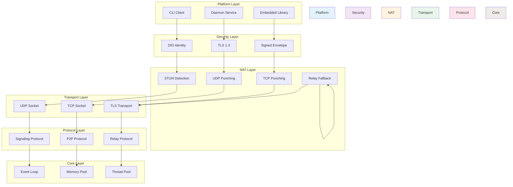
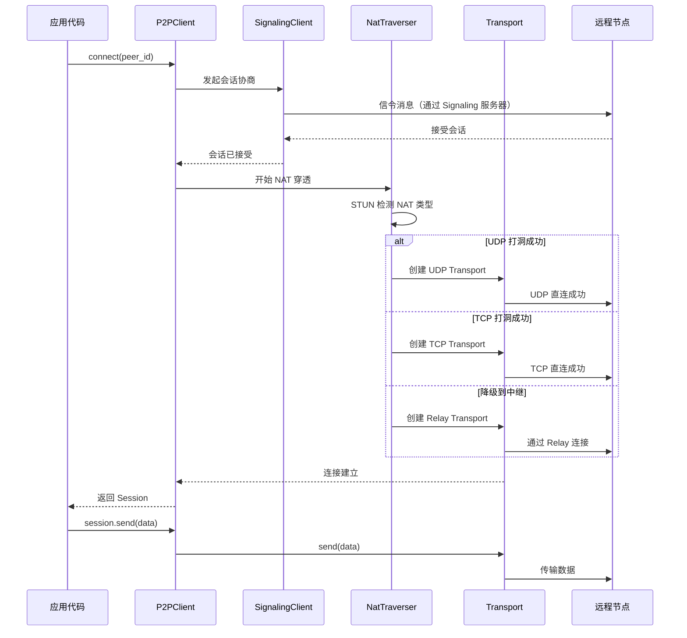
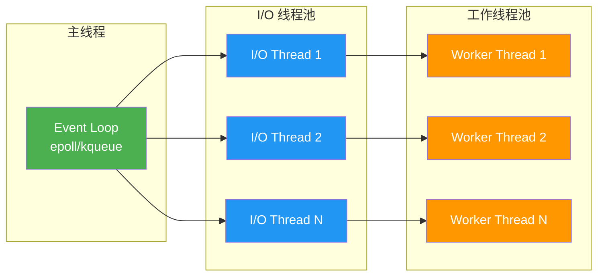

# 架构设计

PeerLink 采用模块化的六层架构设计，每层职责清晰，依赖关系明确。

---

## 模块职责表

| 层级 | 模块 | 职责 | 关键类 |
|------|------|------|--------|
| **Core Layer** | 事件循环 | 跨平台事件分发 | `EventLoop`, `EpollEventLoop` |
| | 内存池 | 高效内存管理 | `MemoryPool`, `BufferPool` |
| | 线程池 | 异步任务调度 | `ThreadPool`, `TaskQueue` |
| **Protocol Layer** | 信令协议 | 会话建立与信令交换 | `SignalingClient`, `SessionNegotiator` |
| | P2P 协议 | 点对点数据传输 | `P2PSession`, `P2PTransport` |
| | 中继协议 | 中继服务器通信 | `RelayClient`, `RelaySession` |
| **Transport Layer** | UDP Socket | UDP 传输封装 | `UdpSocket`, `UdpEndpoint` |
| | TCP Socket | TCP 传输封装 | `TcpSocket`, `TcpListener` |
| | TLS Transport | TLS 安全传输 | `TlsTransport`, `TlsSession` |
| **NAT Layer** | STUN 检测 | NAT 类型检测 | `StunClient`, `NatDetector` |
| | UDP 打洞 | UDP Hole Punching | `UdpHolePuncher` |
| | TCP 打洞 | TCP Simultaneous Open | `TcpHolePuncher` |
| | Relay 降级 | 中继连接管理 | `RelayFallback` |
| **Security Layer** | DID 身份 | 去中心化身份 | `DidIdentity`, `DidResolver` |
| | TLS 1.3 | 传输层安全 | `TlsConfig`, `CertificateManager` |
| | 签名信封 | 消息签名验证 | `SignedEnvelope`, `SignatureVerifier` |
| **Platform Layer** | CLI | 命令行客户端 | `CliApp`, `CommandHandler` |
| | 守护进程 | 后台服务 | `DaemonService`, `PidManager` |
| | 嵌入式库 | 可集成库 | `PeerLinkLib`, `P2PClient` |

---

## 依赖关系图



---

## 关键类和接口

### P2PClient（主入口类）

```cpp
namespace peerlink {

class P2PClient {
public:
    // 连接到远程节点
    Future<Session> connect(const std::string& peer_id);

    // 监听入站连接
    void listen(const ConnectionCallback& callback);

    // 断开连接
    void disconnect(const std::string& session_id);

    // 发送数据
    Future<void> send(const std::string& session_id, const Bytes& data);

    // 接收数据
    void receive(const DataCallback& callback);

private:
    std::unique_ptr<SignalingClient> signaling_;
    std::unique_ptr<NatTraverser> nat_traverser_;
    std::unique_ptr<SessionManager> session_mgr_;
};

}
```

### Session（会话类）

```cpp
namespace peerlink {

class Session {
public:
    enum class State {
        Connecting,
        Connected,
        Disconnected,
        Failed
    };

    // 获取会话状态
    State get_state() const;

    // 获取连接类型（直连/中继）
    ConnectionType get_type() const;

    // 发送数据
    Future<void> send(const Bytes& data);

    // 接收数据
    void set_receive_callback(const DataCallback& callback);

    // 关闭会话
    void close();

private:
    std::string session_id_;
    std::unique_ptr<Transport> transport_;
    State state_;
};

}
```

### Transport（传输层接口）

```cpp
namespace peerlink {

class Transport {
public:
    virtual ~Transport() = default;

    // 连接到远程端点
    virtual Future<void> connect(const Endpoint& remote) = 0;

    // 发送数据
    virtual Future<void> send(const Bytes& data) = 0;

    // 接收数据
    virtual void set_receive_callback(const DataCallback& callback) = 0;

    // 关闭连接
    virtual void close() = 0;

    // 获取传输统计
    virtual TransportStats get_stats() const = 0;
};

}
```

---

## 数据流：从连接到传输

以下是 `P2PClient::connect()` 到实际数据传输的完整路径：



### 详细步骤

1. **应用调用**: 用户代码调用 `P2PClient::connect(peer_id)`
2. **信令协商**: SignalingClient 与远程节点交换连接信息
3. **NAT 检测**: NatTraverser 通过 STUN 检测 NAT 类型
4. **打洞尝试**:
   - 优先尝试 UDP Hole Punching
   - 失败则尝试 TCP Simultaneous Open
   - 最后降级到 Relay
5. **传输建立**: 创建对应的 Transport（UdpTransport / TcpTransport / RelayTransport）
6. **会话就绪**: 返回 Session 对象给用户
7. **数据传输**: 用户通过 Session::send() 发送数据，由 Transport 负责实际传输

---

## 内存管理

PeerLink 使用自定义内存池来优化性能：

```cpp
namespace peerlink {

class MemoryPool {
public:
    // 分配内存
    void* allocate(size_t size);

    // 释放内存
    void deallocate(void* ptr);

    // 获取统计信息
    PoolStats get_stats() const;

private:
    // 小对象分配器（< 4KB）
    std::unique_ptr<SmallObjectAllocator> small_allocator_;

    // 大对象分配器（>= 4KB）
    std::unique_ptr<LargeObjectAllocator> large_allocator_;

    // 线程本地缓存
    thread_local std::unique_ptr<ThreadLocalCache> tls_cache_;
};

}
```

---

## 线程模型

PeerLink 采用事件循环 + 线程池的混合模型：



---

**下一步**: [与其他方案对比](comparisons.md) · [API 参考](../reference/api.md)
