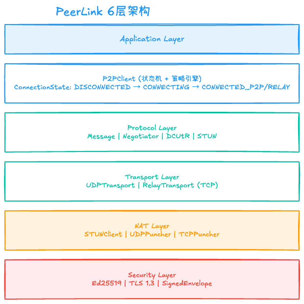
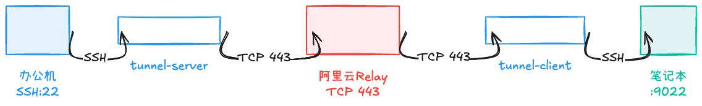

# Circuit Relay v2 详解

## 概述

Circuit Relay v2 是 libp2p 的中继协议，允许两个无法直接建立 P2P 连接的节点通过中继服务器进行通信。

## 为什么需要 Relay？

### 使用场景

1. **防火墙阻断**: 企业防火墙阻止所有入站连接
2. **对称 NAT**: UDP/TCP 打洞均失败
3. **IPv6 隔离**: 一方只有 IPv4，另一方只有 IPv6
4. **保底方案**: 作为 P2P 穿透失败后的最后手段

### 架构示意



```
无法直连的设备A ←→ Relay Server ←→ 无法直连的设备B
```

## 与 TURN 的区别

| 特性 | Circuit Relay v2 | TURN (RFC 5766) |
|------|------------------|-----------------|
| **协议基础** | libp2p 流多路复用 | STUN 扩展 |
| **路径升级** | 支持 DCUtR 升级 | 不支持 |
| **多路复用** | 原生支持 | 需要额外通道 |
| **认证** | Ed25519 签名 | STUN 消息摘要 |
| **发现** | libp2p DHT | 手动配置 |

## 协议组成

Circuit Relay v2 由两个子协议组成：

### 1. Hop 协议

用于主动发起中继连接的节点。

#### 消息类型

```protobuf
enum HopMessageType {
    RESERVE = 0,
    CONNECT = 1,
    STATUS = 2
}
```

#### RESERVE - 预留中继槽位

```cpp
// Initiator → Relay
message ReserveRequest {
    // 空，仅用于预留
}

message ReserveResponse {
    bytes reservation_id;  // 预留 ID（Voucher）
    int32 ttl;            // 有效期（秒）
    repeated addrs;       // Relay 的可用地址
}
```

**用途**: 在 Relay 服务器上预留一个槽位，获取 Voucher。

#### CONNECT - 建立连接

```cpp
// Initiator → Relay
message ConnectRequest {
    bytes peer_id;           // 目标 Peer ID
    bytes reservation_id;    // Voucher
}

message ConnectResponse {
    bytes peer_id;          // 确认的 Peer ID
    int32 status;           // 0=成功, 非0=失败
    string message;         // 错误信息
}
```

#### STATUS - 连接状态

```cpp
message StatusMessage {
    int32 status;           // 状态码
    string message;         // 状态描述
}
```

### 2. Stop 协议

用于被动接受中继连接的节点。

#### 消息类型

```protobuf
enum StopMessageType {
    CONNECT = 0,
    STATUS = 1
}
```

#### CONNECT - 接受连接

```cpp
// Relay → Responder
message ConnectRequest {
    bytes peer_id;           // 发起者的 Peer ID
    bytes reservation_id;    // Voucher
}

// Responder → Relay
message ConnectResponse {
    int32 status;           // 0=接受, 非0=拒绝
    string message;         // 可选消息
}
```

## Voucher 机制

Voucher 是一种临时的授权凭证，用于防止 Relay 资源滥用。

### 生成流程

```cpp
// Relay 服务器生成 Voucher
std::string GenerateVoucher(const std::string& peer_id) {
    std::string voucher = RandomBytes(16);
    reservations_[voucher] = {
        .peer_id = peer_id,
        .expires_at = now() + kReservationTTL
    };
    return voucher;
}
```

### TTL 管理

```cpp
constexpr int32_t kReservationTTL = 600;  // 10 分钟

// 定期清理过期 Voucher
void CleanupExpiredReservations() {
    auto now = Clock::now();
    for (auto it = reservations_.begin(); it != reservations_.end(); ) {
        if (it->second.expires_at < now) {
            it = reservations_.erase(it);
        } else {
            ++it;
        }
    }
}
```

## Forwarder - 数据转发

### 双向转发

```cpp
class RelayForwarder {
public:
    void StartForwarding(
        const std::string& conn_a_id,
        const std::string& conn_b_id
    ) {
        // 启动双向转发
        AsyncForward(conn_a_id, conn_b_id);
        AsyncForward(conn_b_id, conn_a_id);
    }

private:
    void AsyncForward(const std::string& from, const std::string& to) {
        io_context_.post([this, from, to]() {
            while (active_) {
                auto data = Read(from);
                if (data) {
                    Write(to, *data);
                    bytes_forwarded_ += data->size();
                }
            }
        });
    }

    std::map<std::string, std::shared_ptr<Connection>> connections_;
    std::atomic<uint64_t> bytes_forwarded_{0};
};
```

### 带宽限制

```cpp
class TokenBucket {
public:
    TokenBucket(size_t rate_bytes_per_sec)
        : rate_(rate_bytes_per_sec)
        , tokens_(rate_bytes_per_sec)
        , last_refill_(Clock::now()) {}

    bool Consume(size_t bytes) {
        Refill();
        if (tokens_ >= bytes) {
            tokens_ -= bytes;
            return true;
        }
        return false;
    }

private:
    void Refill() {
        auto now = Clock::now();
        auto elapsed = std::chrono::duration_cast<std::chrono::seconds>(
            now - last_refill_
        ).count();
        tokens_ = std::min(rate_, tokens_ + elapsed * rate_);
        last_refill_ = now;
    }

    size_t rate_;
    size_t tokens_;
    TimePoint last_refill_;
};
```

## RelayTransport 实现

### 状态机

```cpp
enum class State {
    DISCONNECTED,      // 未连接
    CONNECTING,        // TCP 连接中
    REGISTERING,       // 注册中
    REGISTERED,        // 已注册
    RELAY_CONNECTING,  // Relay 连接中
    RELAYING,          // 转发中
    FAILED             // 失败
};
```

### 注册流程

```cpp
// transport/relay_transport.hpp
void RelayTransport::start(
    std::function<void(const std::error_code&)> callback
) {
    do_connect([this, callback](const std::error_code& ec) {
        if (ec) {
            state_ = State::FAILED;
            callback(ec);
            return;
        }
        do_register(callback);
    });
}

void RelayTransport::do_register(
    std::function<void(const std::error_code&)> callback
) {
    state_ = State::REGISTERING;

    // 发送 REGISTER 命令
    std::string cmd = "REGISTER " + did_ + "\n";
    boost::asio::write(socket_, boost::asio::buffer(cmd));

    // 等待 OK 响应
    read_response([this, callback](const std::string& line, const std::error_code& ec) {
        if (line.substr(0, 2) == "OK") {
            state_ = State::REGISTERED;
            callback({});
        } else {
            state_ = State::FAILED;
            callback(std::make_error_code(std::errc::connection_refused));
        }
    });
}
```

### 连接对等节点

```cpp
void RelayTransport::connect_to_peer(
    const std::string& target_did,
    std::function<void(const std::error_code&)> callback
) {
    if (state_ != State::REGISTERED) {
        callback(std::make_error_code(std::errc::not_connected));
        return;
    }

    state_ = State::RELAY_CONNECTING;

    // 发送 CONNECT 命令
    std::string cmd = "CONNECT " + target_did + "\n";
    boost::asio::write(socket_, boost::asio::buffer(cmd));

    // 等待 OK CONNECTED 响应
    read_response([this, target_did, callback](const std::string& line, const std::error_code& ec) {
        if (line.find("OK CONNECTED") == 0) {
            state_ = State::RELAYING;
            start_relay_read();
            callback({});
        } else {
            state_ = State::REGISTERED;  // 退回到已注册状态
            callback(std::make_error_code(std::errc::connection_refused));
        }
    });
}
```

### 数据转发

```cpp
void RelayTransport::start_relay_read() {
    do_relay_read();
}

void RelayTransport::do_relay_read() {
    auto buffer = std::make_shared<std::vector<uint8_t>>(4096);
    socket_.async_read_some(boost::asio::buffer(*buffer),
        [this, buffer](const std::error_code& ec, size_t bytes_transferred) {
            if (ec) {
                handle_disconnect(ec);
                return;
            }
            buffer->resize(bytes_transferred);
            if (receive_callback_) {
                receive_callback_(*buffer);
            }
            do_relay_read();
        }
    );
}
```

## 性能优化

### 零拷贝优化

```cpp
// 使用 std::span 避免拷贝
void RelayTransport::send(
    const std::vector<uint8_t>& data,
    SendCallback callback
) {
    // 直接引用，不拷贝
    std::span<const uint8_t> view(data);

    // 使用 scatter-gather I/O
    std::vector<boost::asio::const_buffer> buffers;
    buffers.push_back(boost::asio::buffer(view));
    // ...
}
```

### Session Lookup 优化

```cpp
class RelayConnectionManager {
public:
    std::shared_ptr<RelaySession> FindSession(const std::string& did) {
        // 使用 unordered_map O(1) 查找
        auto it = sessions_by_did_.find(did);
        if (it != sessions_by_did_.end()) {
            return it->second;
        }
        return nullptr;
    }

private:
    std::unordered_map<std::string, std::shared_ptr<RelaySession>> sessions_by_did_;
    std::unordered_map<uint32_t, std::shared_ptr<RelaySession>> sessions_by_fd_;
};
```

## SSH 隧道应用

### 场景

通过 Relay 建立 SSH 隧道，远程访问企业内网机器。



### tunnel-server (办公机)

```bash
# 注册到 relay 并转发到本地 SSH
./p2p-tunnel-server office-001 127.0.0.1 22 \
    --relay-server <YOUR_SERVER_IP>:443 \
    --relay-mode relay-only
```

### tunnel-client (笔记本)

```bash
# 连接到 office-001，本地 9022 端口映射到远端 SSH
./p2p-tunnel-client home-001 office-001 9022 22 \
    --relay-server <YOUR_SERVER_IP>:443 \
    --relay-mode relay-only

# SSH 连接
ssh -p 9022 <USER>@127.0.0.1
```

## 配置示例

### 服务端配置

```toml
[relay]
listen_addr = "0.0.0.0:443"
max_connections = 10000
max_bandwidth_per_connection = "10MB"
reservation_ttl = 600  # 秒
cleanup_interval = 60  # 秒

[security]
require_auth = true
auth_timeout = 30
```

### 客户端配置

```cpp
P2PConfig config;
config.relay_server = "<YOUR_SERVER_IP>";
config.relay_port = 443;
config.relay_mode = RelayMode::AUTO;  // 先尝试 P2P，失败后用 Relay
config.connection_timeout = std::chrono::seconds(30);
```

## 监控指标

### Relay 服务器指标

```cpp
struct RelayMetrics {
    uint64_t active_connections;
    uint64_t total_connections;
    uint64_t bytes_forwarded;
    uint64_t packets_forwarded;
    double avg_latency_ms;
    double throughput_mbps;
};
```

### 客户端指标

```cpp
struct RelayTransportMetrics {
    uint64_t bytes_sent;
    uint64_t bytes_received;
    std::chrono::duration<double> connection_duration;
    size_t reconnect_count;
};
```

## 故障排查

### 连接失败

**检查清单**:

1. Relay 服务器是否运行: `nc -zv <YOUR_SERVER_IP> 443`
2. 防火墙是否放行 443 端口
3. TLS 证书是否有效（如果使用 TLS）
4. DID 是否已注册

### 性能问题

**优化方向**:

1. 启用零拷贝: 使用 `std::span` 传递数据
2. 调整缓冲区大小: 根据网络状况调整
3. 带宽限制: 使用 Token Bucket 防止单个连接占用过多带宽

## 参考资料

- [libp2p Circuit Relay v2 Specification](https://github.com/libp2p/specs/blob/master/relay/circuit-v2.md)
- [RFC 5766 - TURN](https://tools.ietf.org/html/rfc5766)
- [libp2p Go Implementation](https://github.com/libp2p/go-libp2p/tree/master/p2p/protocol/circuitv2/relay)
