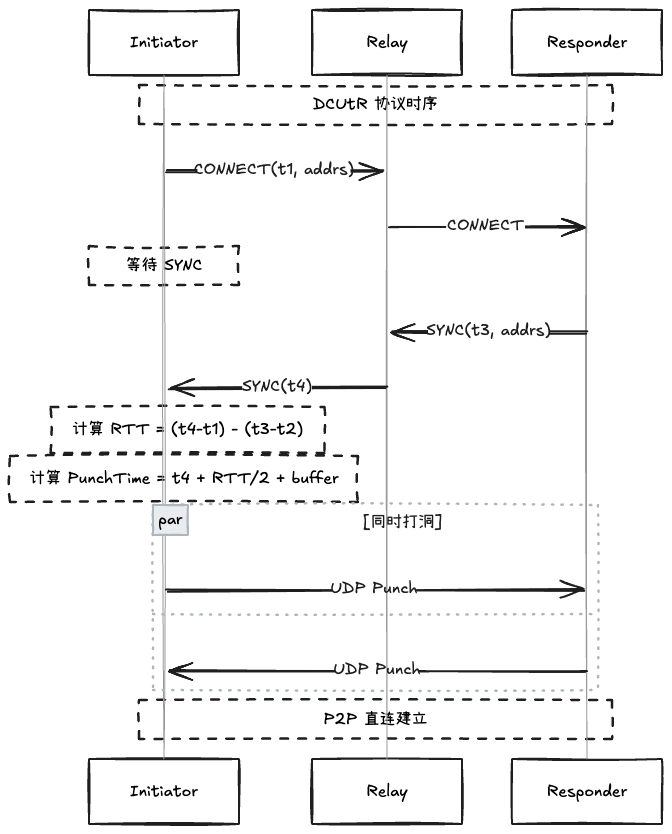

# DCUtR 协议详解

## 概述

DCUtR (Direct Connection Upgrade through Relay) 是 libp2p 的一个协议，用于通过中继服务器协调两端的打洞时间，从而将中继连接升级为 P2P 直连。

## 为什么需要 DCUtR？

### 问题

在 P2P 连接中，双方可能位于不同的 NAT 后：

```
Initiator (NAT A) ←→ Relay ←→ Responder (NAT B)
```

**直接打洞的挑战**:

1. **NAT 映映射有效期短**: 大多数 NAT 映射只有 30-60 秒有效期
2. **同时性要求**: 双方必须几乎同时发送 UDP 包
3. **时钟偏差**: 两端时钟可能有数秒偏差
4. **RTT 不确定性**: 网络延迟是动态的

### DCUtR 的解决方案

通过 Relay 作为协调者，计算精确的打洞时间：

```
1. Initiator → Relay → Responder: CONNECT (t1)
2. Responder → Relay → Initiator: SYNC (t3, t4)
3. 双方计算: PunchTime = t4 + RTT/2 + buffer
4. 在 PunchTime 同时发送 UDP 包
```

## 协议流程

### 消息类型

```cpp
enum class DCUtRMessageType {
    CONNECT = 0,  // Initiator → Responder
    SYNC = 1      // Responder → Initiator
};
```

### CONNECT 消息

```protobuf
message ConnectMessage {
    repeated bytes addrs;        // Initiator 的候选地址
    int64 timestamp_ns;          // 发送时间戳 t1
}
```

### SYNC 消息

```protobuf
message SyncMessage {
    repeated bytes addrs;        // Responder 的候选地址
    int64 echo_timestamp_ns;     // 回显 t1
    int64 timestamp_ns;          // 发送时间戳 t3
}
```

## RTT 计算

DCUtR 使用类似 NTP 的算法计算 RTT：

```
t1: Initiator 发送 CONNECT
t2: Responder 收到 CONNECT
t3: Responder 发送 SYNC
t4: Initiator 收到 SYNC

RTT = (t4 - t1) - (t3 - t2)
```

### 代码实现

```cpp
// protocol/dcutr.hpp
int64_t DCUtRCoordinator::measure_rtt(
    int64_t t1_send,
    int64_t t4_receive,
    int64_t t2_receive,
    int64_t t3_send
) {
    // RTT = (接收时间 - 发送时间) - (处理延迟)
    int64_t rtt = (t4_receive - t1_send) - (t3_send - t2_receive);
    return rtt > 0 ? rtt : 0;
}
```

## PunchSchedule 计算

### Initiator 计算

```cpp
PunchSchedule DCUtRCoordinator::calculate_initiator_schedule(
    int64_t t4_receive,
    int64_t rtt_ns,
    const std::vector<Address>& target_addrs
) {
    PunchSchedule schedule;
    schedule.rtt_ns = rtt_ns;
    schedule.target_addrs = target_addrs;

    // 打洞时间 = 收到 SYNC 时间 + RTT/2 + 缓冲
    schedule.punch_time_ns = t4_receive + (rtt_ns / 2) + PUNCH_BUFFER_MS * 1_000_000;

    return schedule;
}
```

### Responder 计算

```cpp
PunchSchedule DCUtRCoordinator::calculate_responder_schedule(
    int64_t t3_send,
    int64_t rtt_ns,
    const std::vector<Address>& target_addrs
) {
    PunchSchedule schedule;
    schedule.rtt_ns = rtt_ns;
    schedule.target_addrs = target_addrs;

    // 打洞时间 = 发送 SYNC 时间 + RTT/2 + 缓冲
    schedule.punch_time_ns = t3_send + (rtt_ns / 2) + PUNCH_BUFFER_MS * 1_000_000;

    return schedule;
}
```

### 缓冲时间 (PUNCH_BUFFER_MS)

```cpp
constexpr int64_t PUNCH_BUFFER_MS = 100;  // 100ms 缓冲
```

**为什么需要缓冲？**

1. 补偿时钟偏差
2. 补偿 RTT 计算误差
3. 给 NAT 映射建立时间

## 完整时序图



### 阶段详解

#### 1. 发现阶段

```cpp
// Initiator
auto session = dcutr.InitiateUpgrade(peer_id, local_addrs);
auto connect_msg = session->get_connect_message();
relay.send(connect_msg);  // t1
```

#### 2. 响应阶段

```cpp
// Responder
auto session = dcutr.RespondToUpgrade(peer_id, local_addrs, connect_msg);
session->on_connect_received(connect_msg);  // t2

auto sync_msg = session->get_sync_message();
relay.send(sync_msg);  // t3
```

#### 3. 同步阶段

```cpp
// Initiator
session->on_sync_received(sync_msg);  // t4

auto schedule = session->get_punch_schedule();
// schedule.punch_time_ns 已计算好
```

#### 4. 打洞阶段

```cpp
// 双方同时执行
coordinator.WaitUntilPunchTime(schedule.punch_time_ns);
puncher.punch(schedule.target_addrs, schedule.punch_time_ns);
```

## 状态机

```cpp
enum class DCUtRState {
    IDLE,           // 初始状态
    CONNECT_SENT,   // 已发送 CONNECT
    SYNC_RECEIVED,  // 已收到 SYNC
    PUNCHING,       // 正在打洞
    COMPLETED,      // 成功建立直连
    FAILED          // 失败
};
```

### 状态转换

```
IDLE → CONNECT_SENT: Initiator 发送 CONNECT
IDLE → SYNC_RECEIVED: Responder 收到 CONNECT (隐式)
CONNECT_SENT → SYNC_RECEIVED: Initiator 收到 SYNC
SYNC_RECEIVED → PUNCHING: 开始打洞
PUNCHING → COMPLETED: 打洞成功
PUNCHING → FAILED: 打洞失败
```

## NAT 穿透协调器

```cpp
class NATTraversalCoordinator {
public:
    void execute_coordinated_punch(
        const protocol::PunchSchedule& schedule,
        PunchCallback callback
    );

    void execute_with_relay_fallback(
        const protocol::PunchSchedule& schedule,
        std::shared_ptr<Connection> relay_connection,
        PunchCallback callback
    );

private:
    std::unique_ptr<UDPPuncher> udp_puncher_;
    std::unique_ptr<TCPPuncher> tcp_puncher_;

    void WaitUntilPunchTime(int64_t punch_time_ns);
    PunchResult SelectBest(const std::vector<PunchResult>& results);
};
```

### 多地址尝试

DCUtR 支持多地址并发打洞：

```cpp
std::vector<protocol::Address> addrs = {
    "/ip4/203.0.113.10/udp/8000",
    "/ip4/198.51.100.20/udp/9000",
    "/ip6/2001:db8::1/udp/8000"
};

// 并发尝试所有地址
auto results = puncher.punch(addrs, schedule.punch_time_ns);
auto best = SelectBest(results);
```

## 与 TURN 的对比

| 特性 | DCUtR | TURN |
|------|-------|------|
| **中继用途** | 协调打洞，不传输数据 | 持续中转所有数据 |
| **带宽成本** | 低（仅控制消息） | 高（所有数据） |
| **延迟** | 低（直连后无中继） | 高（始终中继） |
| **升级路径** | 自动升级到直连 | 无法升级 |
| **适用场景** | 可打洞的 NAT | 完全阻塞的防火墙 |

## 最佳实践

### 1. 超时设置

```cpp
P2PConfig config;
config.punch_timeout = std::chrono::seconds(10);  // 打洞超时
config.connection_timeout = std::chrono::seconds(30);  // 连接超时
```

### 2. 重试策略

```cpp
config.max_retries = 3;  // 失败后重试 3 次
```

### 3. 地址候选

```cpp
// 提供多个候选地址
std::vector<Address> addrs = {
    // STUN 获取的公网地址
    stun_public_addr,
    // 本地 LAN 地址
    local_lan_addr,
    // IPv6 地址（如果有）
    ipv6_addr
};
```

## 故障排查

### 打洞失败

**可能原因**:

1. **时钟偏差过大**: 检查两端时钟同步
2. **RTT 波动**: 网络不稳定，增加 PUNCH_BUFFER_MS
3. **对称 NAT**: 尝试 TCP 打洞或降级到 Relay

### 连接断开

**可能原因**:

1. **NAT 映射过期**: 发送 keepalive
2. **IP 地址变化**: 重新执行 DCUtR

## 参考资料

- [libp2p DCUtR Specification](https://github.com/libp2p/specs/blob/master/relay/dcutr.md)
- [RFC 5389 - STUN](https://tools.ietf.org/html/rfc5389)
- [WebRTC ICE](https://tools.ietf.org/html/rfc8445)
