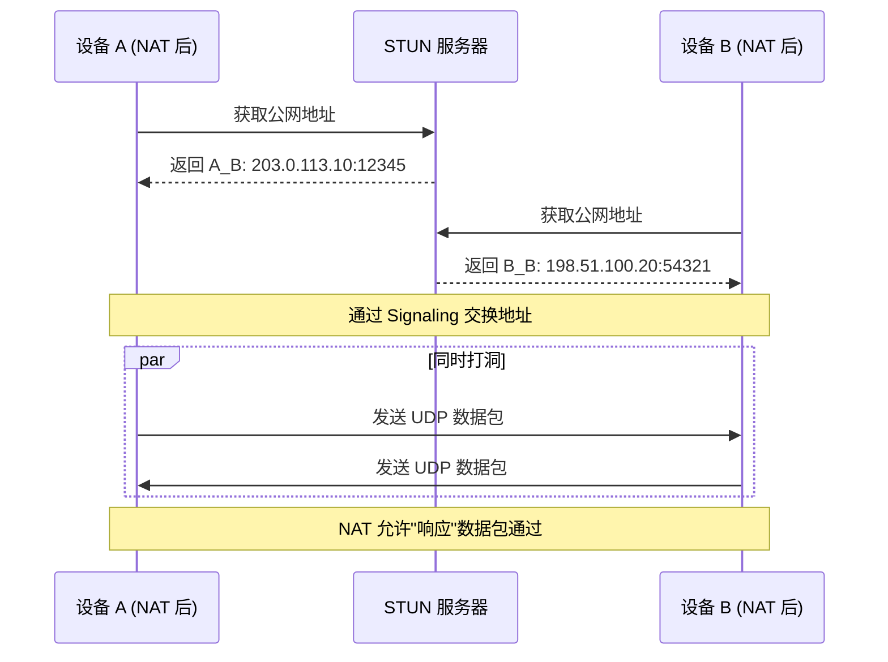
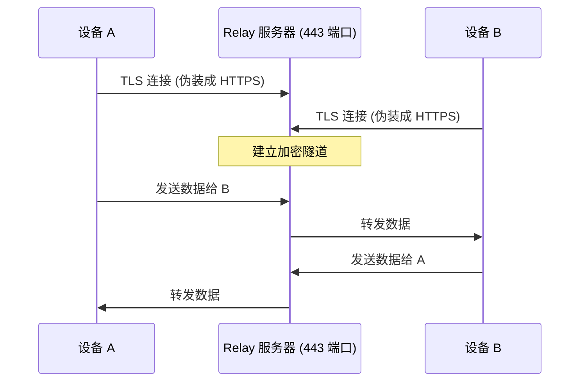
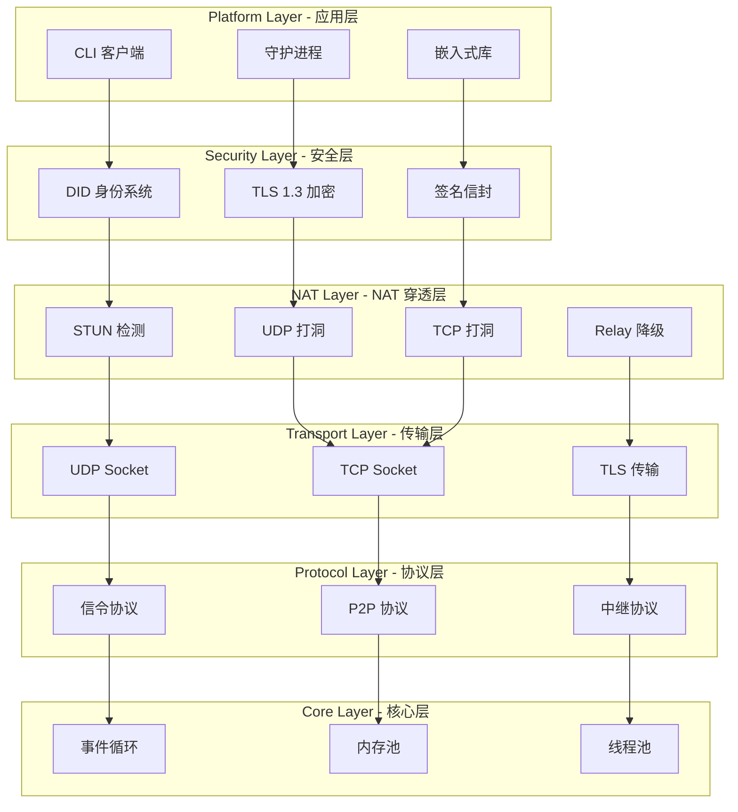

# PeerLink 工作原理

## 问题：被封锁的连接

你在家里的电脑前，想通过 SSH 连接到公司的服务器。但是，你的请求被企业防火墙无情地拒绝了。

企业防火墙有一个简单的规则：**封锁所有入站连接**。

这意味着：
- ✅ 你可以从公司内部访问外部服务（出站连接被允许）
- ❌ 外部无法主动连接到公司内部的设备（入站连接被封锁）

这是企业安全的必要措施，但也给远程访问带来了巨大挑战。传统的解决方案（端口映射、VPN、反向代理）要么需要管理员权限，要么需要复杂的配置。

**有没有办法在不改变企业防火墙配置的情况下，实现安全的远程访问？**

---

## 核心发现：所有 P2P 产品都走 TCP 443

在研究 Tailscale、ZeroTier、AnyDesk 等成熟的 P2P 产品时，我们发现了一个共同点：

**它们都使用 TCP 443 端口建立连接。**

TCP 443 是 HTTPS 的默认端口。企业防火墙 100% 会放行 HTTPS 流量，因为这是互联网正常运作的基础。

这意味着，如果我们伪装成 HTTPS 流量，企业防火墙就会让我们通过。

但这只是最后的一层保障。在此之前，PeerLink 会尝试更高效的方式建立连接。

---

## 三层降级架构

PeerLink 采用智能的降级策略，从最优方案到兜底方案依次尝试：

### Layer 1: UDP Hole Punching（最优）

**成功率**: ~80% (Cone NAT 场景)

**原理**:
1. 双方分别通过 STUN 服务器获取自己的公网地址和端口
2. 通过 Signaling 服务器交换地址信息
3. **同时**向对方发送 UDP 数据包
4. NAT 设备看到"出站"连接，会允许对应的"入站"数据包通过

**为什么有效**：
大多数 NAT 设备有一个简单规则：如果你先发送数据到某个地址，那么来自该地址的响应数据包会被允许进入。



### Layer 2: TCP Hole Punching（备选）

**成功率**: ~30%

**原理**:
利用 TCP 的 Simultaneous Open 特性，双方同时向对方发起 TCP 连接请求。

**为什么成功率较低**：
许多 NAT 设备对 TCP 的处理比 UDP 严格，会拒绝没有 SYN 标志的入站数据包。

### Layer 3: TCP 443 TLS Relay（兜底）

**成功率**: ~100%

**原理**:
当直连失败后，双方都主动连接到 Relay 服务器，使用 TCP 443 端口（伪装成 HTTPS）。

**为什么有效**：
1. 企业防火墙允许 TCP 443 出站连接
2. 双方都是"主动连接"，不涉及入站连接
3. Relay 服务器作为中继，转发双方的数据



---

## PeerLink 的答案

PeerLink 将上述 NAT 穿透技术封装成一个完整的 P2P 通信平台。

### 六层架构



### 身份系统：DID + Ed25519

每个 PeerLink 节点都有唯一的身份标识：

```
did:peer:1zQmWvQxTqbGvZGh7Yh4z7Yh4z7Yh4z7Yh4z7Yh4z7Yh4z7
```

这个 DID 由 Ed25519 公钥生成，确保：
- **全球唯一**: 基于公钥生成，不会冲突
- **不可伪造**: 没有私钥无法生成对应的 DID
- **可验证**: 任何节点都可以验证签名的有效性

### 安全：TLS 1.3 + SignedEnvelope

所有数据传输都经过双重保护：

1. **TLS 1.3**: 提供传输层加密和认证
2. **SignedEnvelope**: 每个消息都包含签名，确保数据完整性

### 性能：C++20 实现

PeerLink 使用现代 C++ (C++20) 实现，目标性能指标：

- **直连吞吐量**: > 500 Mbps
- **中继吞吐量**: > 50 Mbps
- **连接建立时间**: < 2 秒
- **内存占用**: < 50 MB
- **CPU 占用**: < 5% (空闲)

---

## 总结

PeerLink 通过以下方式解决了企业防火墙封锁的问题：

1. **优先尝试 UDP Hole Punching**: 在 Cone NAT 场景下实现 P2P 直连
2. **备选 TCP Hole Punching**: 在支持 Simultaneous Open 的 NAT 上工作
3. **兜底 TCP 443 Relay**: 伪装成 HTTPS 流量，确保 100% 连接成功率

这一切对用户是透明的。你只需要运行：

```bash
peerlink connect <remote-peer-id>
```

PeerLink 会自动选择最佳连接方式，让你的设备在任何网络环境下都能互联。

---

**下一步**: [了解详细架构](architecture.md) · [开始部署](../tutorials/deployment.md)
