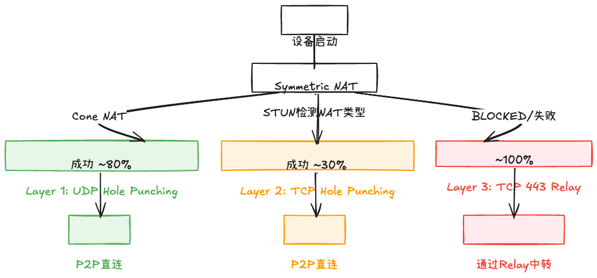

# NAT 穿透原理

## 概述

NAT（Network Address Translation）网络地址转换是现代互联网中最常见的障碍，它让位于局域网内的设备能够共享一个公网 IP 地址访问互联网，但也阻止了外部设备主动发起连接到局域网内设备。

NAT 穿透（NAT Traversal）是一组技术，用于在 NAT 设备后建立 P2P 直连。

## NAT 类型分类

根据 RFC 3489/5389 标准，NAT 设备可以分为以下几种类型：

### 1. 公网 IP (Public IP)

设备直接拥有公网 IP 地址，无需 NAT 穿透。

**成功率**: 100% 直连

### 2. 全锥形 NAT (Full Cone NAT)

- **特点**: 只要有一个内网地址:端口映射到公网，任何外部设备都可以通过这个公网地址:端口发送数据
- **穿透难度**: ⭐ (最容易)
- **成功率**: ~80%

```
内网 192.168.1.100:5000 → 映射 → 公网 203.0.113.10:8000
任何外部设备都可以向 203.0.113.10:8000 发送数据
```

### 3. 受限锥形 NAT (Restricted Cone NAT)

- **特点**: 只有内网设备曾经发送过数据的外部 IP 才能发送数据回来
- **穿透难度**: ⭐⭐
- **成功率**: ~70%

### 4. 端口受限锥形 NAT (Port Restricted Cone NAT)

- **特点**: 只有内网设备曾经发送过数据的外部 IP:端口才能发送数据回来
- **穿透难度**: ⭐⭐⭐
- **成功率**: ~60%

### 5. 对称 NAT (Symmetric NAT)

- **特点**: 每个目标地址都使用不同的公网端口映射
- **穿透难度**: ⭐⭐⭐⭐⭐ (最难)
- **成功率**: ~5% (UDP 打洞)

```
内网 192.168.1.100:5000 → 目标A → 公网 203.0.113.10:8000
内网 192.168.1.100:5000 → 目标B → 公网 203.0.113.10:8001 (不同端口！)
```

### 6. 阻塞 (Blocked)

- **特点**: UDP 流量被防火墙完全阻止
- **穿透方式**: 仅 TCP 443 Relay

## STUN 工作原理

STUN (Session Traversal Utilities for NAT) 是一种用于检测 NAT 类型的协议。

### STUN 消息类型

```
┌────────────────────────────────────┐
│ STUN Binding Request               │
├────────────────────────────────────┤
│ Type: 0x0001 (Binding Request)     │
│ Length: 0                          │
│ Magic Cookie: 0x2112A442           │
│ Transaction ID: (96 bits)          │
└────────────────────────────────────┘
```

### XOR-MAPPED-ADDRESS 属性

STUN 服务器响应包含客户端的公网地址和端口：

```
┌────────────────────────────────────┐
│ XOR-MAPPED-ADDRESS                 │
├────────────────────────────────────┤
│ Family: IPv4 (0x01)                │
│ Port: (XOR with magic cookie)      │
│ Address: (XOR with magic cookie)   │
└────────────────────────────────────┘
```

**为什么使用 XOR？** 防止某些 NAT 设备修改地址字段导致错误。

## UDP 打洞原理 (UDP Hole Punching)

### 同时开放 (Simultaneous Open)

UDP 打洞的核心思想是让双方同时向对方的公网地址发送数据包：

```
时间线:
  t0: 双方通过信令交换 STUN 获取的公网地址
  t1: Initiator 发送 UDP 包到 Responder 的公网地址
  t2: Responder 发送 UDP 包到 Initiator 的公网地址
  t3: NAT 设备看到"出站"连接，允许"入站"响应
  t4: P2P 连接建立！
```

### 为什么会成功？

1. **NAT 映射保持**: 大多数 NAT 设备在看到出站流量后会创建映射
2. **同时性**: 双方几乎同时发送，各自 NAT 都认为这是"响应"而非"新连接"
3. **地址已交换**: 通过 STUN + 信令服务器，双方都知道对方的公网地址

### 局限性

- **对称 NAT**: 每个目标使用不同端口，预测失败
- **防火墙**: 企业防火墙可能阻止所有 UDP

## TCP 打洞原理

### TCP Simultaneous Open

TCP 打洞使用 TCP 的同时开放特性：

```cpp
// Initiator
socket.connect(responder_public_addr, port);

// Responder (同时)
socket.connect(initiator_public_addr, port);

// 结果: 双方都发送 SYN
// 如果成功，建立 TCP 连接
```

### 优势

- TCP 可靠传输
- 更好的防火墙兼容性

### 局限性

- 需要操作系统支持 TCP Simultaneous Open
- 成功率低于 UDP 打洞

## 对称 NAT 的挑战

对称 NAT 是最难穿透的类型：

1. **端口预测困难**: 每个目标地址使用不同端口
2. **映射算法不透明**: 不同 NAT 设备使用不同算法
3. **打洞窗口极短**: 映射可能只有几秒有效期

### 端口预测 (Port Prediction)

某些 NAT 设备的端口分配是可预测的：

```
算法: port = base + (target_port % 1000)
预测成功率: ~5-10%
```

**PeerLink 不依赖端口预测**，直接降级到 TCP Relay。

## PeerLink 的自动降级策略

PeerLink 实现了三层降级机制：

```cpp
// p2p_client.hpp
enum class RelayMode {
    AUTO,             // 先尝试直连 P2P，失败后使用中继
    RELAY_PREFERRED,  // 优先使用中继，但也允许直连
    RELAY_ONLY,       // 直接使用中继，跳过 STUN/打洞
    DIRECT_ONLY       // 永不使用中继
};
```

### 降级流程图



### Layer 1: UDP Hole Punching

- **触发条件**: STUN 检测到 Cone NAT
- **成功率**: Full Cone ~80%, Restricted ~70%, Port Restricted ~60%
- **延迟**: < 50ms
- **带宽**: 无限制

### Layer 2: TCP Hole Punching

- **触发条件**: UDP 打洞失败 或 Symmetric NAT
- **成功率**: ~30%
- **延迟**: < 100ms
- **带宽**: 无限制

### Layer 3: TCP 443 Relay

- **触发条件**: TCP 打洞失败 或 UDP 被阻断
- **成功率**: ~100%
- **延迟**: +30-50ms (经 Relay 服务器)
- **带宽**: 受 Relay 服务器限制

### 自动切换

```cpp
// P2PClient 会自动检测并切换
ConnectionPath active_path_;  // NONE → DIRECT_P2P → RELAY

// 查询当前路径
if (client.is_p2p()) {
    std::cout << "P2P 直连" << std::endl;
} else {
    std::cout << "Relay 中转" << std::endl;
}
```

## 与其他方案对比

| 方案 | UDP 打洞 | TCP 打洞 | Relay | 成功率 | 延迟 |
|------|---------|---------|-------|--------|------|
| **PeerLink** | ✅ | ✅ | ✅ | ~100% | < 100ms |
| WebRTC ICE | ✅ | ✅ | ✅ | ~95% | < 150ms |
| Tailscale | ✅ | ✅ | DERP | ~100% | < 200ms |
| Syncthing | ✅ | ❌ | ❌ | ~80% | < 50ms |
| 向日葵 | ✅ | ❌ | ✅ | ~95% | < 150ms |

## 参考资料

- [RFC 5389 - STUN](https://tools.ietf.org/html/rfc5389)
- [RFC 3489 - STUN (Obsolete)](https://tools.ietf.org/html/rfc3489)
- [libp2p NAT 穿透](https://docs.libp2p.io/concepts/nat/)
- [WebRTC ICE](https://tools.ietf.org/html/rfc8445)
