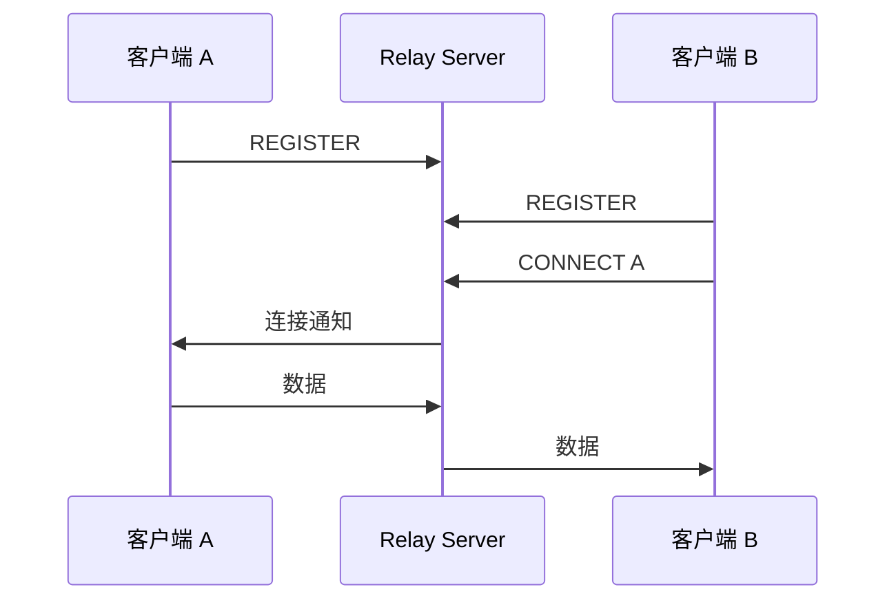

# 文档贡献指南

本指南说明如何为 PeerLink 项目撰写、改进和维护文档。

---

## 文档结构

PeerLink 文档遵循 [Diataxis](https://diataxis.fr/) 四象限框架：

```
┌────────────────────────────┬────────────────────────────────┐
│  Tutorials (教程)          │  How-to Guides (操作指南)       │
│  "跟着做，学起来"          │  "解决特定问题"                 │
├────────────────────────────┼────────────────────────────────┤
│  Concepts (概念)           │  Reference (参考文档)           │
│  "理解工作原理"            │  "查阅 API/配置/协议"          │
└────────────────────────────┴────────────────────────────────┘
```

### 如何判断内容属于哪个象限

| 问题 | 象限 | 举例 |
|------|------|------|
| "我想从零开始学习" | Tutorials | SSH 隧道教程、Python SDK 入门 |
| "我要完成某个具体任务" | How-to | 配置 TLS、部署到阿里云 |
| "我想理解为什么这样设计" | Concepts | NAT 穿透原理、安全模型 |
| "我需要查 API 或配置项" | Reference | C API 文档、配置参数表 |

!!! tip "关键区别"
    - **Tutorial** 是学习导向的，读者跟着一步步做
    - **How-to** 是任务导向的，读者已经有基础，只需解决特定问题
    - **Concept** 是理解导向的，不需要代码示例也能理解
    - **Reference** 是信息导向的，力求精确和完整

---

## 目录结构

```
docx/
├── mkdocs.yml              # 站点配置和导航
├── requirements.txt        # Python 依赖
├── docs/
│   ├── index.md            # 首页
│   ├── tutorials/          # 教程（学习导向）
│   │   ├── quick-start.md
│   │   ├── ssh-tunnel.md
│   │   ├── mobile-connect.md
│   │   └── python-sdk.md
│   ├── how-to/             # 操作指南（任务导向）
│   │   ├── configuration.md
│   │   ├── troubleshoot.md
│   │   └── performance.md
│   ├── concepts/           # 概念说明（理解导向）
│   │   ├── how-peerlink-works.md
│   │   ├── architecture.md
│   │   └── comparisons.md
│   ├── reference/          # 参考文档（信息导向）
│   │   ├── api.md
│   │   ├── protocol.md
│   │   └── config.md
│   └── contributing/       # 贡献指南
│       ├── index.md
│       └── documentation.md
├── i18n/en/                # 英文翻译
└── overrides/              # 自定义模板
```

---

## 写作风格

### 基本原则

1. **简洁**: 每句话传达一个要点
2. **准确**: 技术信息必须正确且与代码一致
3. **有代码示例**: 每个操作步骤都配有可运行的代码
4. **中英双语**: 中文为主，保持术语的英文标注

### 语言要求

- 中文为主体语言
- 技术术语保留英文，如 NAT、STUN、Relay、DID
- 首次出现的术语提供中英文对照，如"打洞（Hole Punching）"

### 代码示例规范

代码示例必须是可运行的，并指定语言：

````markdown
```bash
# 好的示例：有注释、可直接运行
# 启动 relay tunnel 客户端
./relay-tunnel client \
  --did home-mac \
  --target office-213 \
  --relay <YOUR_SERVER_IP>:9443 \
  --listen 9022
```
````

### Admonition 使用

使用 MkDocs Material 的 admonition 语法标注提示和警告：

```markdown
!!! tip "标题（可选）"
    有用的提示信息。

!!! warning "标题（可选）"
    需要注意的事项或风险提示。

!!! note "标题（可选）"
    补充说明信息。
```

---

## Markdown 规范

### Frontmatter 格式

每个页面必须包含 YAML frontmatter：

```yaml
---
title: 页面标题
description: 页面简短描述（一句话）
tags:
  - 标签1
  - 标签2
  - 标签3
---
```

### 标题层级

- `#` (H1) — 页面标题（每个页面仅一个）
- `##` (H2) — 主要章节
- `###` (H3) — 子章节
- 避免 H4 以下层级，考虑拆分页面

### 代码块

指定语言以启用语法高亮：

````markdown
```bash
echo "Hello"
```

```cpp
#include <iostream>
```

```python
print("Hello")
```

```yaml
key: value
```
````

### 表格

使用表格呈现结构化数据：

```markdown
| 参数 | 类型 | 默认值 | 说明 |
|------|------|--------|------|
| host | str | localhost | 服务器地址 |
```

### Mermaid 图表

流程图和时序图使用 Mermaid：

```markdown

```

### 交叉引用

使用相对路径引用其他文档：

```markdown
参见 [部署教程](../tutorials/deployment.md) 了解详情。
```

---

## 本地预览

### 安装依赖

```bash
cd docx
pip install -r requirements.txt
```

`requirements.txt` 内容：

```
mkdocs-material>=9.0
mkdocs-i18n>=0.3
mike>=1.1
```

### 启动开发服务器

```bash
cd docx
mkdocs serve
```

浏览器访问 `http://localhost:8000`。修改文件后页面会自动刷新。

### 构建静态站点

```bash
mkdocs build
```

生成的静态文件在 `docx/site/` 目录。

---

## 添加新页面

### 1. 创建 Markdown 文件

在对应的目录下创建 `.md` 文件，例如添加新教程：

```bash
touch docx/docs/tutorials/my-new-tutorial.md
```

### 2. 编写内容

添加 frontmatter 和内容：

```markdown
---
title: 新教程标题
description: 新教程的简短描述
tags:
  - 教程
  - 新标签
---

# 新教程标题

教程正文...
```

### 3. 注册到导航

编辑 `docx/mkdocs.yml`，在 `nav` 部分添加新页面：

```yaml
nav:
  - 首页: index.md
  # ...
  - 教程:
      - tutorials/quick-start.md
      - tutorials/ssh-tunnel.md
      - tutorials/mobile-connect.md
      - tutorials/python-sdk.md
      - tutorials/my-new-tutorial.md  # 添加这一行
```

### 4. 本地验证

```bash
cd docx
mkdocs serve
```

检查新页面是否在导航中正确显示，内容渲染是否正常。

---

## 中英双语

PeerLink 文档要求中英双语。中文为默认语言，英文翻译放在 `i18n/en/` 目录下，保持相同的目录结构。

### 翻译流程

1. 在 `docs/` 下完成中文版本
2. 将文件复制到 `i18n/en/` 对应路径
3. 翻译为英文
4. 确保 frontmatter 的 `title` 和 `description` 也翻译

### 术语表

| 中文 | English |
|------|---------|
| 打洞 | Hole Punching |
| 信令 | Signaling |
| 中继 | Relay |
| 穿透 | Traversal |
| 设备标识 | DID (Device ID) |
| 数据通道 | Data Channel |
| 降级 | Fallback |
| 保活 | Keepalive |

---

## 文档质量检查

提交文档 PR 前，确认以下事项：

- [ ] 包含正确的 YAML frontmatter
- [ ] 标题层级不跳级（H1 唯一，层级递进）
- [ ] 代码块指定了语言
- [ ] 内部链接指向正确路径（本地 `mkdocs serve` 验证）
- [ ] Admonition 格式正确
- [ ] Mermaid 图表语法正确
- [ ] 中英双语（英文版本同步更新）
- [ ] 技术信息与代码实现一致
- [ ] 无拼写错误和排版问题

---

**下一步**: [贡献指南](index.md) | [开发指南](development.md) | [测试指南](testing.md)
