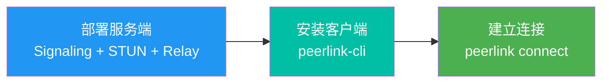
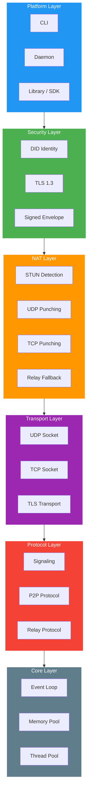

# PeerLink

**开源 P2P 安全访问平台**

基于 NAT 穿透和零信任架构，让设备互联像魔法一样简单。

<div class="grid cards" markdown>

-   :material-rocket-launch:{ .lg .middle } __快速开始__

    ---

    5 分钟完成首次 P2P 连接

    [:octicons-arrow-right-24: 快速开始教程](tutorials/quick-start.md)

-   :material-server:{ .lg .middle } __部署服务端__

    ---

    在云服务器上一键部署

    [:octicons-arrow-right-24: 部署指南](tutorials/deployment.md)

-   :material-book-open-variant:{ .lg .middle } __了解原理__

    ---

    深入理解 NAT 穿透技术

    [:octicons-arrow-right-24: 工作原理](concepts/how-peerlink-works.md)

-   :material-github:{ .lg .middle } __参与贡献__

    ---

    开源社区欢迎你

    [:octicons-arrow-right-24: 贡献指南](contributing/overview.md)

</div>

---

## 选择你的路径

你是谁？选择最适合你的学习路线：

<div class="persona-cards" markdown>

<div class="persona-card" data-persona="developer" markdown>
:material-code-tags:{ .persona-icon }

### :material-code-tags: 开发者

将 PeerLink SDK 集成到你的产品中。

[:material-arrow-right: Python SDK 入门](tutorials/python-sdk.md){ .persona-cta }
[:material-file-code: C API 参考](reference/c-api.md){ .persona-link }
[:material-swap-horizontal: 协议规范](reference/protocols.md){ .persona-link }
</div>

<div class="persona-card" data-persona="ops" markdown>
:material-server-security:{ .persona-icon }

### :material-server-security: 运维工程师

部署和维护 PeerLink 服务。

[:material-arrow-right: 部署到阿里云](how-to/deploy-aliyun.md){ .persona-cta }
[:material-certificate: 配置 TLS/WSS](how-to/configure-tls.md){ .persona-link }
[:material-chart-line: 监控告警](how-to/monitoring.md){ .persona-link }
</div>

<div class="persona-card" data-persona="evaluator" markdown>
:material-scale-balance:{ .persona-icon }

### :material-scale-balance: 技术决策者

评估 PeerLink 是否适合你的需求。

[:material-arrow-right: 竞品对比](concepts/comparisons.md){ .persona-cta }
[:material-shape-outline: 架构总览](concepts/architecture.md){ .persona-link }
[:material-speedometer: 性能基准](concepts/performance.md){ .persona-link }
</div>

</div>

---

## 核心特性

<div class="grid cards" markdown>

-   :material-firewall:{ .lg .middle } __穿透企业防火墙__

    通过智能 NAT 穿透技术，突破企业防火墙限制，实现无需端口映射的 P2P 直连。三层降级架构确保 99%+ 连接成功率。

-   :material-swap-vertical:{ .lg .middle } __NAT 自动打洞__

    UDP Hole Punch → TCP Simultaneous Open → TLS Relay，自动选择最优路径。无需手动配置，开箱即用。

-   :material-shield-lock:{ .lg .middle } __零信任安全__

    DID 去中心化身份 + Ed25519 数字签名 + TLS 1.3 端到端加密。无需预共享密钥，无需 CA 证书。

</div>

---

## 三步快速开始



**1. 部署服务端**

```bash
# 在云服务器上一键部署
git clone https://github.com/your-org/peerlink.git
cd peerlink && mkdir build && cd build
cmake .. && make -j$(nproc)
./deploy/start.sh
```

**2. 安装客户端**

```bash
# macOS / Linux 一键安装
curl -fsSL https://get.peerlink.io | sh
```

**3. 建立连接**

```bash
peerlink daemon                # 启动守护进程
peerlink whoami                # 查看你的 Peer ID
peerlink connect <remote-id>   # 连接到远程设备
```

---

## 为什么选择 PeerLink？

| 特性 | PeerLink | FRP | Tailscale | ZeroTier |
|------|:--------:|:---:|:---------:|:--------:|
| P2P 直连 | :white_check_mark: | :x: | :white_check_mark: | :white_check_mark: |
| 自托管 | :white_check_mark: | :white_check_mark: | :x: SaaS | :warning: 付费 |
| 零第三方依赖 | :white_check_mark: | :white_check_mark: | :x: DERP | :x: 根服务器 |
| NAT 穿透 | :white_check_mark: 三层 | :x: | :white_check_mark: | :white_check_mark: |
| 高性能 | C++20 | Go | Go | 虚拟网卡 |
| 开源协议 | MIT | Apache 2.0 | BSD | BSL 1.1 |

---

## 技术架构

PeerLink 采用模块化的六层架构：



---

## 性能指标

| 指标 | 数值 | 说明 |
|------|------|------|
| 直连吞吐量 | **> 500 Mbps** | 千兆网络环境 |
| 中继吞吐量 | **> 50 Mbps** | 受限于服务器带宽 |
| 连接建立 | **< 2 秒** | NAT 穿透场景 |
| 内存占用 | **< 50 MB** | 守护进程 |
| CPU 占用 | **< 5%** | 空闲状态 |

---

## 社区

PeerLink 采用 **MIT License** 开源，欢迎社区贡献。

[:material-github: GitHub](https://github.com/your-org/peerlink){ .md-button }
[:material-bug: 报告问题](https://github.com/your-org/peerlink/issues){ .md-button }
[:material-chat: 加入讨论](https://github.com/your-org/peerlink/discussions){ .md-button }
[:material-heart: 贡献代码](contributing/overview.md){ .md-button }

---

<small>:material-copyright: 2024-2026 PeerLink Contributors. Licensed under MIT License.</small>
