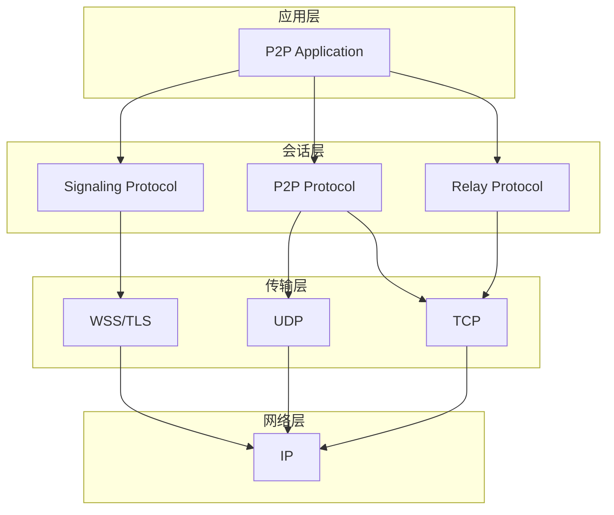
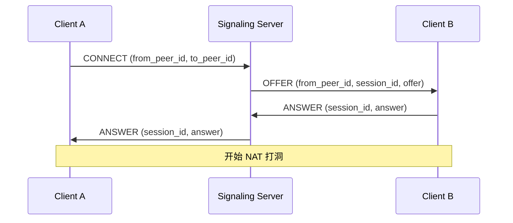
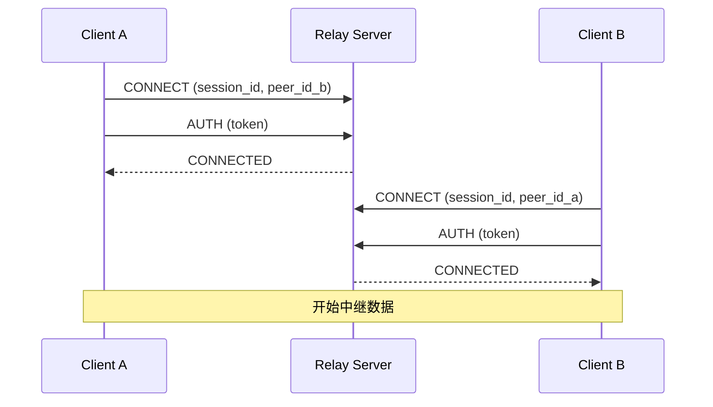
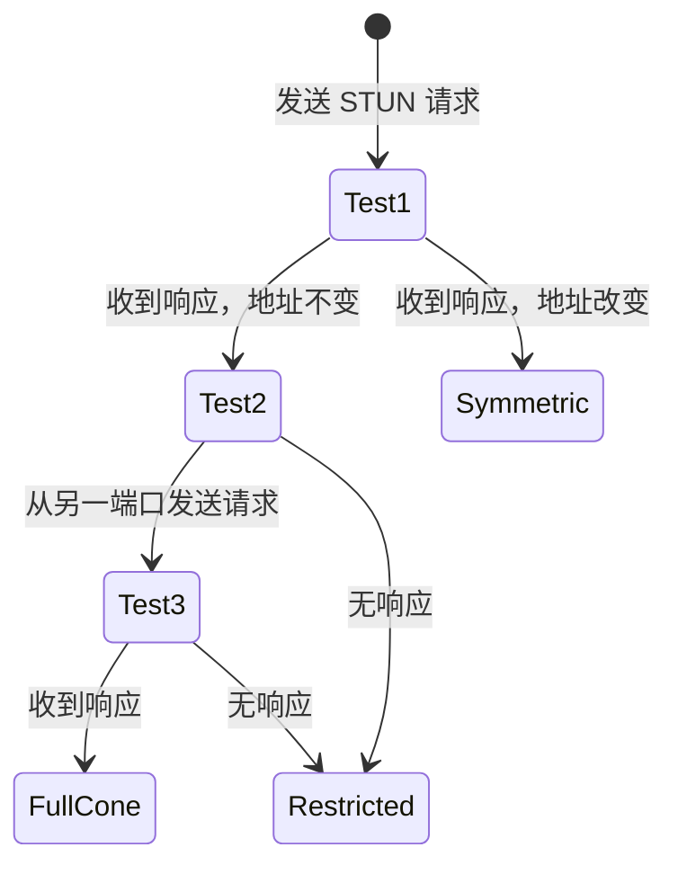

# 协议参考

PeerLink 使用的网络协议详细说明。

---

## 协议概览

PeerLink 使用多种协议实现 P2P 通信：



---

## 1. Signaling Protocol

信令协议用于会话建立和协商。

### 1.1 连接建立



### 1.2 消息格式

```json
{
  "type": "offer",          // 消息类型: offer, answer, ice, close
  "version": "1.0",         // 协议版本
  "session_id": "sess_abc", // 会话 ID
  "from_peer_id": "did:peer:...",  // 发送方 Peer ID
  "to_peer_id": "did:peer:...",    // 接收方 Peer ID
  "timestamp": 1234567890, // 时间戳
  "signature": "...",       // 签名

  // Offer/Answer 特定字段
  "candidates": [           // ICE 候选
    {
      "type": "udp",        // udp, tcp
      "address": "203.0.113.10",
      "port": 12345,
      "priority": 100
    }
  ],

  // 信封
  "encryption": {
    "algorithm": "AES-256-GCM",
    "key_id": "...",
    "nonce": "..."
  }
}
```

### 1.3 ICE 候选交换

ICE (Interactive Connectivity Establishment) 候选用于 NAT 穿透：

```json
{
  "type": "ice",
  "session_id": "sess_abc",
  "candidate": {
    "type": "udp",           // udp, tcp, relay
    "address": "203.0.113.10",
    "port": 12345,
    "protocol": "udp",       // udp, tcp
    "relay_addr": null,      // 仅 relay 类型
    "priority": 100
  }
}
```

---

## 2. P2P Protocol

点对点数据传输协议。

### 2.1 帧格式

```
+----------------+----------------+--------------------+------------------+
| Magic (4B)     | Length (4B)    | Type (2B)          | Flags (2B)       |
+----------------+----------------+--------------------+------------------+
| Session ID (16B)                                    | Seq Num (8B)     |
+----------------+----------------+--------------------+------------------+
| Timestamp (8B) | Checksum (4B)  | Payload (Variable)                    |
+----------------+----------------+--------------------------------------+
```

**字段说明**：

| 字段 | 大小 | 说明 |
|------|------|------|
| Magic | 4B | 魔数 `0x504C4E4B` ("PLNK") |
| Length | 4B | Payload 长度 |
| Type | 2B | 帧类型 (DATA, ACK, PING, PONG, CLOSE) |
| Flags | 2B | 标志位 |
| Session ID | 16B | 会话 ID |
| Seq Num | 8B | 序列号 |
| Timestamp | 8B | 时间戳 (微秒) |
| Checksum | 4B | CRC32 校验和 |
| Payload | Variable | 有效载荷 |

### 2.2 帧类型

```cpp
enum class FrameType : uint16_t {
    DATA   = 0x01,  // 数据帧
    ACK    = 0x02,  // 确认帧
    PING   = 0x03,  // 心跳帧
    PONG   = 0x04,  // 心跳响应
    CLOSE  = 0x05,  // 关闭帧
    BATCH  = 0x06   // 批量数据帧
};
```

### 2.3 可靠传输

使用选择性重传 (SACK) 实现可靠传输：

```
Sender                                    Receiver
  |                                         |
  | DATA (seq=0, len=1000)                 |
  |---------------------------------------->|
  |                                         |
  | DATA (seq=1000, len=1000)              |
  |---------------------------------------->|
  |                                         |
  | ACK (ack=2000, sack=3000:4000,5000:6000)|
  |<----------------------------------------|
  |                                         |
  | DATA (seq=2000, len=1000)              |
  | DATA (seq=3000, len=1000)              |
  | DATA (seq=4000, len=1000)              |
  |---------------------------------------->|
```

---

## 3. Relay Protocol

中继协议，用于 NAT 穿透失败时的数据转发。

### 3.1 连接建立



### 3.2 消息格式

```
+----------------+----------------+----------------+------------------+
| Magic (4B)     | Length (4B)    | Type (1B)      | Reserved (3B)    |
+----------------+----------------+----------------+------------------+
| Session ID (16B)                                        |
+----------------+----------------+----------------+------------------+
| Peer ID (64B)                                           |
+----------------+----------------+----------------+------------------+
| Payload (Variable)                                      |
+---------------------------------------------------------+
```

**消息类型**：

```cpp
enum class RelayMessageType : uint8_t {
    CONNECT    = 0x01,
    CONNECTED  = 0x02,
    DATA       = 0x03,
    DISCONNECT = 0x04,
    PING       = 0x05,
    PONG       = 0x06,
    AUTH       = 0x07
};
```

### 3.3 认证

Relay 使用 Token 认证：

```json
{
  "type": "auth",
  "token": "eyJhbGciOiJIUzI1NiIsInR5cCI6IkpXVCJ9...",
  "peer_id": "did:peer:...",
  "timestamp": 1234567890,
  "signature": "..."
}
```

Token 格式：JWT (JSON Web Token)

---

## 4. STUN Protocol

用于 NAT 类型检测和公网地址发现。

### 4.1 STUN 请求

```
+----------------+----------------+------------------------------------+
| Type (2B)      | Length (2B)    | Magic Cookie (0x2112A442)          |
+----------------+----------------+------------------------------------+
| Transaction ID (12B)                                            |
+------------------------------------------------------------------+
| Attributes (Variable)                                            |
+------------------------------------------------------------------+
```

**消息类型**：

- `0x0001`: Binding Request
- `0x0101`: Binding Success Response
- `0x0111`: Binding Error Response

### 4.2 NAT 类型检测



**NAT 类型判定**：

1. **Full Cone**: 任何外部主机都可以通过映射地址通信
2. **Restricted Cone**: 只有曾经通信过的外部主机可以通信
3. **Port-Restricted Cone**: 只有曾经通信过的外部主机和端口可以通信
4. **Symmetric**: 每个目标地址/端口对都有独立的映射

---

## 5. 安全协议

### 5.1 TLS 1.3

所有连接都使用 TLS 1.3 加密：

```
Client                                          Server
  |                                               |
  | ClientHello                                   |
  |----------------------------------------------->|
  |                                               |
  |                    ServerHello                |
  |                    [Certificate]             |
  |                    [Finished]                |
  |<-----------------------------------------------|
  |                                               |
  | [Finished]                                    |
  |----------------------------------------------->|
  |                                               |
  | Application Data                              |
  |<=============================================>|
```

### 5.2 Signed Envelope

每个消息都包含签名：

```json
{
  "payload": "base64encodedpayload",
  "sender": "did:peer:...",
  "recipient": "did:peer:...",
  "timestamp": 1234567890,
  "nonce": "randomnonce",
  "signature": "ed25519signature"
}
```

签名算法：Ed25519

---

## 6. 性能优化

### 6.1 批量传输

```cpp
// 批量帧格式
struct BatchFrame {
    uint32_t count;           // 子帧数量
    SubFrame frames[count];   // 子帧数组
};

struct SubFrame {
    uint64_t seq;             // 序列号
    uint32_t length;          // 长度
    uint8_t data[];           // 数据
};
```

### 6.2 零拷贝

使用共享内存和引用计数避免数据拷贝：

```cpp
class ZeroCopyBuffer {
public:
    std::shared_ptr<std::vector<uint8_t>> data;
    size_t offset;
    size_t length;
};
```

---

**下一步**: [API 参考](api.md) · [安全参考](security.md)
