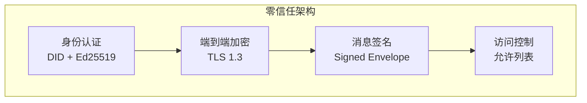
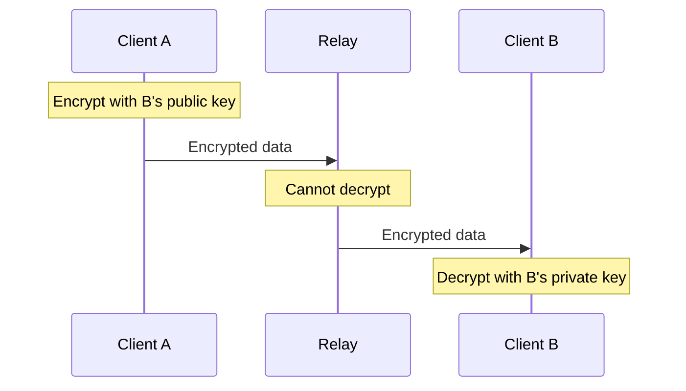
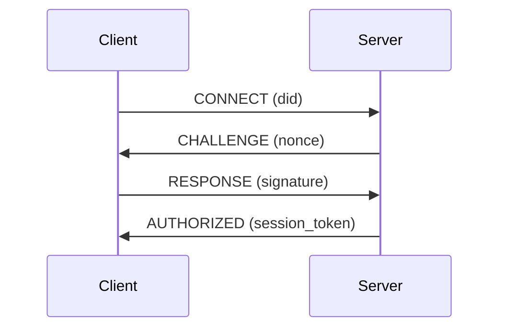

# 安全参考

PeerLink 的安全设计和最佳实践。

---

## 安全模型

PeerLink 采用零信任安全模型：



---

## 1. 身份系统

### 1.1 DID (Decentralized Identity)

每个 PeerLink 节点都有唯一的 DID 标识：

```
did:peer:1zQmWvQxTqbGvZGh7Yh4z7Yh4z7Yh4z7Yh4z7Yh4z7Yh4z7
```

**DID 结构**：

```
did:peer:1z<base58-encoded-multibase-multicodec-did-doc-key>
```

### 1.2 DID 文档

```json
{
  "@context": "https://w3id.org/did/v1",
  "id": "did:peer:1zQmWvQxTqbGvZGh7Yh4z7Yh4z7Yh4z7Yh4z7Yh4z7Yh4z7",
  "verificationMethod": [{
    "id": "did:peer:1zQmWvQxTqbGvZGh7Yh4z7Yh4z7Yh4z7Yh4z7Yh4z7Yh4z7#keys-1",
    "type": "Ed25519VerificationKey2020",
    "controller": "did:peer:1zQmWvQxTqbGvZGh7Yh4z7Yh4z7Yh4z7Yh4z7Yh4z7Yh4z7",
    "publicKeyMultibase": "z6MkhaXgBZDvotDkL5257faiztiGiC2QtKLGpbnnEGta2doK"
  }],
  "authentication": [
    "did:peer:1zQmWvQxTqbGvZGh7Yh4z7Yh4z7Yh4z7Yh4z7Yh4z7Yh4z7#keys-1"
  ],
  "assertionMethod": [
    "did:peer:1zQmWvQxTqbGvZGh7Yh4z7Yh4z7Yh4z7Yh4z7Yh4z7Yh4z7#keys-1"
  ]
}
```

### 1.3 密钥管理

**密钥生成**：

```cpp
auto key_pair = peerlink::crypto::generate_ed25519_key_pair();
auto private_key = key_pair.private_key();
auto public_key = key_pair.public_key();
```

**密钥存储**：

```bash
~/.peerlink/
├── identity.json       # DID 文档（包含公钥）
├── private_key.pem     # 私钥（加密存储）
└── config.yaml         # 配置文件
```

**私钥加密**：

```yaml
security:
  identity:
    key_file: ~/.peerlink/private_key.pem
    encryption:
      algorithm: AES-256-GCM
      key_derivation: PBKDF2-SHA256
      iterations: 100000
```

---

## 2. 加密

### 2.1 TLS 1.3

所有传输层连接都使用 TLS 1.3 加密。

**密码套件**：

```cpp
std::vector<std::string> cipher_suites = {
    "TLS_AES_128_GCM_SHA256",
    "TLS_AES_256_GCM_SHA384",
    "TLS_CHACHA20_POLY1305_SHA256"
};
```

**证书验证**：

```cpp
auto tls_config = peerlink::TlsConfig::create()
    .set_verify_mode(peerlink::VerifyMode::Strict)
    .set_ca_file("/etc/ssl/certs/ca-certificates.crt")
    .set_certificate_file("/path/to/cert.pem")
    .set_private_key_file("/path/to/key.pem");
```

### 2.2 端到端加密

即使在 Relay 模式下，数据也是端到端加密的：



### 2.3 消息加密

**Signed Envelope 格式**：

```json
{
  "version": "1.0",
  "payload": "base64encodedencryptedpayload",
  "sender": "did:peer:...",
  "recipient": "did:peer:...",
  "timestamp": 1234567890,
  "nonce": "randomnonce",
  "encryption": {
    "algorithm": "AES-256-GCM",
    "key_id": "did:peer:...#keys-1"
  },
  "signature": "ed25519signature"
}
```

---

## 3. 认证与授权

### 3.1 认证流程



### 3.2 访问控制

**允许列表**：

```yaml
security:
  acl:
    mode: allowlist  # allowlist 或 denylist
    allowed_peers:
      - did:peer:1zQmWvQxTqbGvZGh7Yh4z7Yh4z7Yh4z7Yh4z7Yh4z7Yh4z7
      - did:peer:1zAbCdEfGhIjKlMnOpQrStUvWxYz1234567890abcdef
```

**使用 API**：

```cpp
auto acl = client.get_acl();
acl.add_allowed_peer("did:peer:1zQmWvQxTqbGvZGh7Yh4z7Yh4z7Yh4z7Yh4z7Yh4z7Yh4z7");
client.set_acl(acl);
```

---

## 4. 安全最佳实践

### 4.1 密钥安全

1. **私钥存储**：
   - 始终加密存储私钥
   - 使用强密码保护
   - 定期轮换密钥

2. **密钥备份**：
   ```bash
   # 导出密钥（加密）
   peerlink key export --output backup.pem --encrypt

   # 恢复密钥
   peerlink key import --input backup.pem
   ```

3. **硬件安全模块**（HSM）：
   ```yaml
   security:
     identity:
       key_store:
         type: hsm  # 或 pkcs11, tpm
         module: /usr/lib/softhsm/libsofthsm2.so
         slot: 0
         pin: env:HSM_PIN
   ```

### 4.2 证书管理

1. **使用 Let's Encrypt**：
   ```bash
   sudo certbot certonly --standalone -d peerlink.example.com
   ```

2. **证书固定**：
   ```yaml
   security:
     tls:
       pin_certificates:
         - "sha256/AAAAAAAAAAAAAAAAAAAAAAAAAAAAAAAAAAAAAAAAAAA="
   ```

3. **证书轮换**：
   ```bash
   # 自动续期
   peerlink cert renew --auto
   ```

### 4.3 网络安全

1. **防火墙规则**：
   ```bash
   # 仅允许必要的端口
   sudo ufw allow 443/tcp comment 'PeerLink Relay'
   sudo ufw allow 8443/tcp comment 'PeerLink Signaling'
   sudo ufw allow 3478/udp comment 'PeerLink STUN'
   ```

2. **速率限制**：
   ```yaml
   server:
     rate_limit:
       enabled: true
       max_connections: 100
       max_requests_per_second: 10
     ```

3. **DDoS 防护**：
   ```yaml
   server:
     ddos_protection:
       enabled: true
       blacklist:
         - "192.0.2.0/24"
       whitelist:
         - "203.0.113.0/24"
   ```

---

## 5. 审计与日志

### 5.1 安全日志

```yaml
logging:
  security:
    enabled: true
    events:
      - authentication
      - authorization
      - connection
      - data_transfer
      - key_rotation
    format: json
    output:
      type: syslog  # 或 file, elasticsearch
      server: localhost:514
```

### 5.2 审计事件

```json
{
  "timestamp": "2024-01-15T10:30:00Z",
  "event_type": "connection_established",
  "peer_id": "did:peer:1zQmWvQxTqbGvZGh7Yh4z7Yh4z7Yh4z7Yh4z7Yh4z7Yh4z7",
  "remote_peer_id": "did:peer:1zAbCdEfGhIjKlMnOpQrStUvWxYz1234567890abcdef",
  "session_id": "sess_abc123",
  "connection_type": "UDP_DIRECT",
  "success": true
}
```

### 5.3 监控告警

```yaml
monitoring:
  alerts:
    - name: "High failure rate"
      condition: "auth_failures > 10 in 1m"
      action: notify

    - name: "Unauthorized connection"
      condition: "unauthorized_connections > 0"
      action: block_and_notify
```

---

## 6. 合规性

### 6.1 数据保护

- **数据加密**: 所有传输数据都经过 TLS 1.3 加密
- **数据最小化**: 只收集必要的日志信息
- **数据保留**: 可配置日志保留期限

### 6.2 隐私保护

- **匿名 DID**: DID 不包含个人身份信息
- **无追踪**: 不记录设备位置或使用模式
- **本地优先**: 数据优先存储在本地

---

## 7. 安全检查清单

部署前请确认：

- [ ] 使用强密码保护私钥
- [ ] 启用 TLS 1.3 并使用有效证书
- [ ] 配置防火墙规则
- [ ] 启用访问控制（允许列表）
- [ ] 配置安全日志
- [ ] 设置监控告警
- [ ] 定期更新到最新版本
- [ ] 进行安全审计

---

**下一步**: [API 参考](api.md) · [协议参考](protocol.md)
