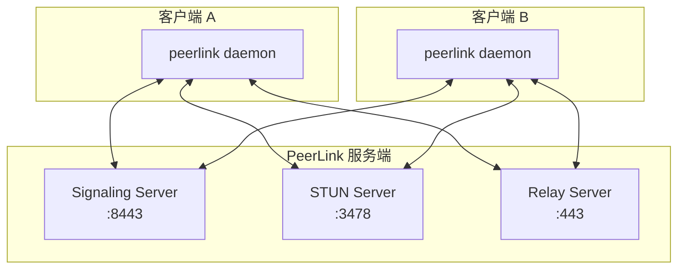

# 部署指南

在生产环境中部署 PeerLink 服务端。

---

## 架构概览

PeerLink 服务端由三个组件组成：



---

## 方案 1: Docker Compose 部署（推荐）

### 准备工作

1. 准备一台服务器（推荐配置：2 核 4G，带宽 10 Mbps+）
2. 安装 Docker 和 Docker Compose
3. 确保以下端口开放：`443/TCP`, `3478/UDP`, `3478/TCP`, `8443/TCP`

### 配置文件

创建 `docker-compose.yml`：

```yaml
version: '3.8'

services:
  signaling:
    image: peerlink/signaling:latest
    container_name: peerlink-signaling
    ports:
      - "8443:8443"
    volumes:
      - ./certs:/app/certs:ro
      - ./config/signaling.yaml:/app/config.yaml:ro
    environment:
      - RUST_LOG=info
    restart: unless-stopped
    networks:
      - peerlink-network

  stun:
    image: peerlink/stun:latest
    container_name: peerlink-stun
    ports:
      - "3478:3478/udp"
      - "3478:3478/tcp"
    restart: unless-stopped
    networks:
      - peerlink-network

  relay:
    image: peerlink/relay:latest
    container_name: peerlink-relay
    ports:
      - "443:443"
    volumes:
      - ./certs:/app/certs:ro
      - ./config/relay.yaml:/app/config.yaml:ro
    environment:
      - RELAY_MAX_CONNECTIONS=1000
      - RELAY_BANDWIDTH_LIMIT=100Mbps
    restart: unless-stopped
    networks:
      - peerlink-network

networks:
  peerlink-network:
    driver: bridge
```

### 生成证书

```bash
# 创建证书目录
mkdir -p certs config

# 生成自签名证书（用于测试）
openssl req -x509 -newkey rsa:4096 -keyout certs/key.pem -out certs/cert.pem -days 365 -nodes -subj "/CN=peerlink.example.com"

# 或使用 Let's Encrypt（生产环境推荐）
# 安装 certbot
sudo apt-get install certbot

# 获取证书
sudo certbot certonly --standalone -d peerlink.example.com

# 复制证书
sudo cp /etc/letsencrypt/live/peerlink.example.com/fullchain.pem certs/cert.pem
sudo cp /etc/letsencrypt/live/peerlink.example.com/privkey.pem certs/key.pem
```

### Signaling 配置

创建 `config/signaling.yaml`：

```yaml
server:
  host: 0.0.0.0
  port: 8443
  tls:
    cert_file: /app/certs/cert.pem
    key_file: /app/certs/key.pem

signaling:
  max_sessions: 10000
  session_timeout: 300s

storage:
  type: redis  # 或 memory（单机测试）
  redis:
    addr: redis:6379
    password: ""
    db: 0
```

### Relay 配置

创建 `config/relay.yaml`：

```yaml
server:
  host: 0.0.0.0
  port: 443
  tls:
    cert_file: /app/certs/cert.pem
    key_file: /app/certs/key.pem

relay:
  max_connections: 1000
  bandwidth_limit: 100Mbps
  idle_timeout: 60s

metrics:
  enabled: true
  port: 9090
```

### 启动服务

```bash
# 启动所有服务
docker-compose up -d

# 查看日志
docker-compose logs -f

# 检查服务状态
docker-compose ps
```

---

## 方案 2: Kubernetes 部署

### Namespace

```yaml
# namespace.yaml
apiVersion: v1
kind: Namespace
metadata:
  name: peerlink
```

### Signaling Deployment

```yaml
# signaling-deployment.yaml
apiVersion: apps/v1
kind: Deployment
metadata:
  name: peerlink-signaling
  namespace: peerlink
spec:
  replicas: 2
  selector:
    matchLabels:
      app: peerlink-signaling
  template:
    metadata:
      labels:
        app: peerlink-signaling
    spec:
      containers:
      - name: signaling
        image: peerlink/signaling:latest
        ports:
        - containerPort: 8443
        volumeMounts:
        - name: certs
          mountPath: /app/certs
          readOnly: true
        - name: config
          mountPath: /app/config.yaml
          subPath: signaling.yaml
          readOnly: true
        resources:
          requests:
            memory: "128Mi"
            cpu: "100m"
          limits:
            memory: "512Mi"
            cpu: "500m"
      volumes:
      - name: certs
        secret:
          secretName: peerlink-certs
      - name: config
        configMap:
          name: peerlink-config
```

### Service

```yaml
# service.yaml
apiVersion: v1
kind: Service
metadata:
  name: peerlink-signaling
  namespace: peerlink
spec:
  type: LoadBalancer
  ports:
  - port: 8443
    targetPort: 8443
  selector:
    app: peerlink-signaling
---
apiVersion: v1
kind: Service
metadata:
  name: peerlink-stun
  namespace: peerlink
spec:
  type: LoadBalancer
  ports:
  - port: 3478
    targetPort: 3478
    protocol: UDP
  selector:
    app: peerlink-stun
---
apiVersion: v1
kind: Service
metadata:
  name: peerlink-relay
  namespace: peerlink
spec:
  type: LoadBalancer
  ports:
  - port: 443
    targetPort: 443
  selector:
    app: peerlink-relay
```

### 部署

```bash
# 应用配置
kubectl apply -f namespace.yaml
kubectl apply -f signaling-deployment.yaml
kubectl apply -f service.yaml

# 查看状态
kubectl get pods -n peerlink
kubectl get svc -n peerlink
```

---

## 方案 3: 二进制部署

### 下载

```bash
# 下载最新版本
wget https://github.com/your-org/peerlink/releases/latest/download/peerlink-server-linux-amd64.tar.gz

# 解压
tar -xzf peerlink-server-linux-amd64.tar.gz
cd peerlink-server
```

### 配置 Systemd 服务

```ini
# /etc/systemd/system/peerlink-signaling.service
[Unit]
Description=PeerLink Signaling Server
After=network.target

[Service]
Type=simple
User=peerlink
Group=peerlink
WorkingDirectory=/opt/peerlink
ExecStart=/opt/peerlink/bin/signaling --config /etc/peerlink/signaling.yaml
Restart=always
RestartSec=5

[Install]
WantedBy=multi-user.target
```

```bash
# 启动服务
sudo systemctl daemon-reload
sudo systemctl enable peerlink-signaling
sudo systemctl start peerlink-signaling

# 查看状态
sudo systemctl status peerlink-signaling
```

---

## 监控和日志

### Prometheus 指标

所有服务都暴露 Prometheus 格式的指标：

```bash
# Signaling 指标
curl http://localhost:9090/metrics

# Relay 指标
curl http://localhost:9091/metrics
```

### 日志聚合

```yaml
# 使用 Docker 日志驱动
services:
  signaling:
    logging:
      driver: "json-file"
      options:
        max-size: "10m"
        max-file: "3"
```

---

## 安全建议

1. **使用 TLS**: 所有服务都应使用 TLS 加密
2. **限制访问**: 使用防火墙限制访问来源
3. **定期更新**: 及时更新到最新版本
4. **监控告警**: 设置 Prometheus 告警规则

---

## 高可用配置

### Signaling 集群

```yaml
# 使用 Redis 做会话存储
signaling:
  storage:
    type: redis
    redis:
      cluster:
        - redis-1:6379
        - redis-2:6379
        - redis-3:6379
```

### Relay 负载均衡

```yaml
# 使用多个 Relay 服务器
relays:
  - addr: relay-1.example.com:443
  - addr: relay-2.example.com:443
  - addr: relay-3.example.com:443
```

---

**下一步**: [配置指南](../how-to/configuration.md) · [故障排查](../how-to/troubleshooting.md)
