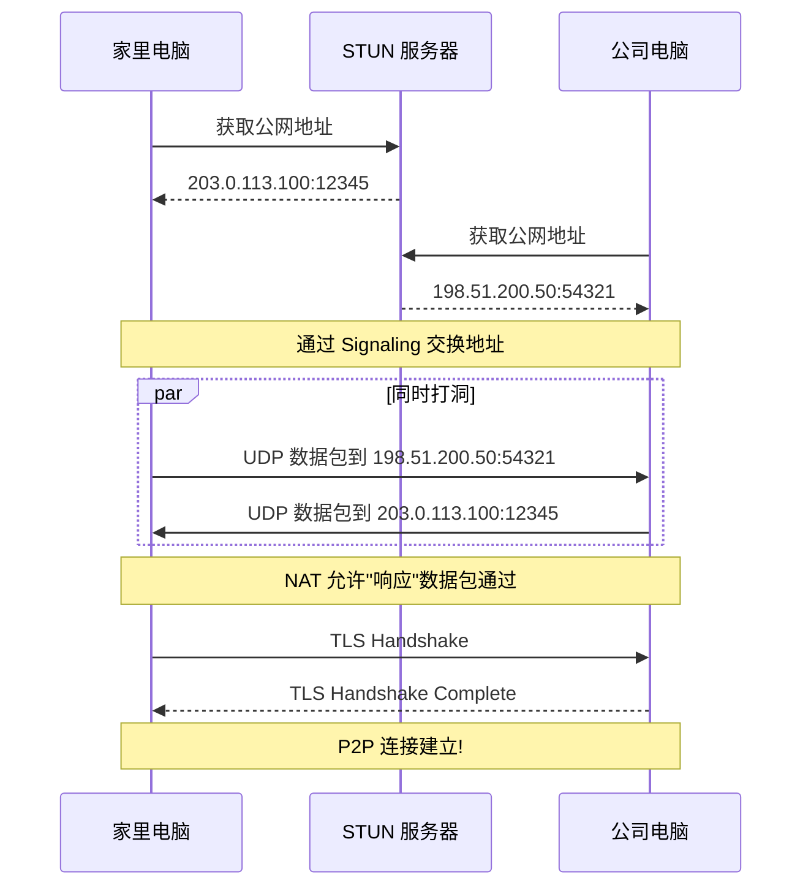

# 建立第一个连接

详细教程：如何使用 PeerLink 建立设备间的 P2P 连接。

---

## 场景介绍

本教程将演示如何建立以下连接：

```
家里电脑 (192.168.1.100) <----> 公司电脑 (10.0.0.50)
```

假设：
- 家里电脑在 NAT 后面（典型的家庭网络）
- 公司电脑在企业防火墙后面（封锁入站连接）

---

## 前提条件

- 已部署 PeerLink 服务端（见[部署指南](deployment.md)）
- 两台设备上都安装了 PeerLink 客户端
- 有服务端的访问地址

---

## 步骤 1: 配置客户端

### 家里电脑

创建配置文件 `~/.peerlink/config.yaml`：

```yaml
# Signaling 服务器地址
signaling_server: wss://peerlink.example.com:8443

# STUN 服务器地址
stun_server: stun:peerlink.example.com:3478

# Relay 服务器地址（最后兜底）
relay_server: peerlink.example.com:443

# 本地监听端口
listen_port: 18888

# 日志级别
log_level: info

# 数据存储路径
data_dir: ~/.peerlink/data
```

### 公司电脑

使用相同的配置。

---

## 步骤 2: 启动守护进程

### 家里电脑

```bash
# 启动守护进程
peerlink daemon

# 查看状态
peerlink status

# 输出示例:
# Daemon status: Running
# PID: 12345
# Listening on: 0.0.0.0:18888
```

### 公司电脑

```bash
# 同样启动守护进程
peerlink daemon
```

---

## 步骤 3: 获取 Peer ID

### 家里电脑

```bash
peerlink whoami

# 输出示例:
# Your Peer ID: did:peer:1zQmWvQxTqbGvZGh7Yh4z7Yh4z7Yh4z7Yh4z7Yh4z7Yh4z7
# Public key: 0x1234567890abcdef...
# Created: 2024-01-15T10:30:00Z
```

**记录这个 Peer ID**，后面会用到。

### 公司电脑

```bash
peerlink whoami

# 输出示例:
# Your Peer ID: did:peer:1zAbCdEfGhIjKlMnOpQrStUvWxYz1234567890abcdef
```

---

## 步骤 4: 建立连接

### 从家里电脑连接到公司电脑

在**家里电脑**上执行：

```bash
# 连接到公司电脑（使用公司的 Peer ID）
peerlink connect did:peer:1zAbCdEfGhIjKlMnOpQrStUvWxYz1234567890abcdef

# 输出示例:
# [INFO] Connecting to peer: did:peer:1zAbCdEfGhIjKlMnOpQrStUvWxYz1234567890abcdef
# [INFO] NAT type: Port-Restricted Cone
# [INFO] Starting UDP hole punching...
# [INFO] UDP hole punching successful!
# [INFO] Connection established: DIRECT (UDP)
# [INFO] Session ID: sess_abc123
# [INFO] Remote address: 203.0.113.50:54321
# [INFO] Latency: 15ms
# [INFO] Connection ready!
```

### 验证连接

```bash
# 查看连接列表
peerlink list

# 输出示例:
# Active connections:
#   Session ID: sess_abc123
#   Peer ID: did:peer:1zAbCdEfGhIjKlMnOpQrStUvWxYz1234567890abcdef
#   Type: DIRECT (UDP)
#   Latency: 15ms
#   Sent: 1024 bytes
#   Received: 2048 bytes
#   Uptime: 5m30s
```

---

## 步骤 5: 传输数据

### 发送消息

在**家里电脑**上：

```bash
# 发送文本消息
echo "Hello from home!" | peerlink send sess_abc123

# 发送文件
peerlink send sess_abc123 --file ~/Documents/report.pdf
```

在**公司电脑**上：

```bash
# 接收消息
peerlink receive

# 输出示例:
# [INFO] Received message from sess_abc123:
# Hello from home!
```

### 测试带宽

```bash
# 测试连接带宽
peerlink benchmark sess_abc123

# 输出示例:
# Testing bandwidth...
# Upload: 487 Mbps
# Download: 523 Mbps
# RTT: 15ms
# Packet loss: 0.1%
```

---

## NAT 穿透过程

让我们看看 NAT 穿透是如何工作的：



---

## 故障排查

### 问题 1: 连接超时

```bash
# 检查 NAT 类型
peerlink detect-nat

# 如果是 Symmetric NAT，可能需要使用中继
peerlink connect <peer-id> --force-relay
```

### 问题 2: 认证失败

```bash
# 检查证书配置
peerlink test tls

# 查看详细日志
peerlink logs --verbose
```

### 问题 3: 防火墙阻止

```bash
# 测试 STUN 连接
peerlink test stun

# 测试 Signaling 连接
peerlink test signaling

# 测试 Relay 连接
peerlink test relay
```

---

## 高级用法

### 持久连接

```bash
# 自动重连
peerlink connect <peer-id> --auto-reconnect

# 设置心跳间隔
peerlink connect <peer-id> --keepalive 30s
```

### 多路复用

```bash
# 在同一连接上创建多个通道
peerlink channel create sess_abc123 --name ssh
peerlink channel create sess_abc123 --name file-transfer
```

### 端口转发

```bash
# 转发本地端口到远程
peerlink forward sess_abc123 --local 2222 --remote 22

# 然后可以通过 SSH 连接
ssh -p 2222 user@localhost
```

---

## 下一步

恭喜！你已经成功建立了第一个 P2P 连接。

- 📖 [了解更多配置选项](../how-to/configuration.md)
- 🚀 [性能优化建议](../how-to/performance.md)
- 🔧 [故障排查指南](../how-to/troubleshooting.md)
